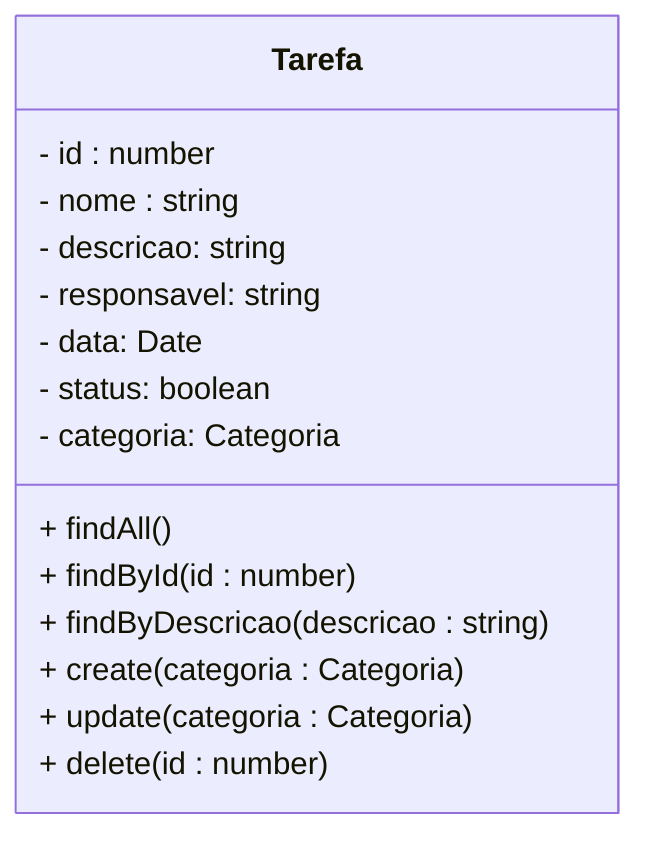
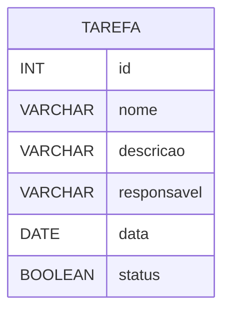

<h1>Projeto 02 - Todo-List - Módulo Tarefa</h1>

O que veremos por aqui:

1. Apresentação do Módulo Tarefa
2. Criar a estrutura de Pastas do Módulo Tarefa
3. Criar a Classe Entidade Tarefa
4. Registrar a Classe Tarefa nos Módulos TarefaModule e AppModule

<h2>1. O Módulo Tarefa</h2>

Nesta etapa vamos começar a construir o Módulo Tarefa. Veja o Diagrama de Classes abaixo: 



<br />

Primeiro vamos construir a **Classe Entidade Tarefa (Model no modelo MVC)**, que será utilizada como modelo para construir a tabela **tb_tarefas** (Entidade) dentro do nosso Banco de dados **db_todolist**. Os campos (Atributos) da tabela serão os mesmos que estão definidos no Diagrama de Classes acima. Na próxima etapa vamos começar a construir as Classes **TarefaService** (Regras de negócio da aplicação) e **TarefaController** (Os métodos do CRUD descritos no Diagrama de Classes).

> **CRUD:** É um acrônimo para **Create** (Persistir dados na tabela), **Read** (Pesquisar dados na tabela), **Update** (Atualizar dados da tabela) e **Delete** (Apagar dados da tabela), ou seja, são os Métodos para interagirmos com as tabelas do nosso Banco de dados.

Depois de criar a Classe Entidade Tarefa, vamos executar o projeto Todo-List no Nest. Após a execução veremos que será criado dentro do Banco de dados **db_todolist**, a tabela **tb_tarefas**. Veja abaixo como ficará a estrutura da nossa tabela através do **Diagrama de Entidade e Relacionamentos (DER)** da tabela tb_tarefas:



O **Dicionário de dados da nossa tabela tb_tarefas** será o seguinte:

| Atributo      | Tipo de dado  | Descrição                             | Chave |
| ------------- | ------------- | ------------------------------------- | ----- |
| **id**        | INT           | Identificador único                   | PK    |
| **nome**      | VARCHAR(30)   | Nome da Tarefa                        |       |
| **descricao** | VARCHAR(5000) | Detalhes da Tarefa                    |       |
| responsavel   | VARCHAR(5000) | Responsável pela Tarefa               |       |
| **data**      | DATETIME      | Data da criação/atualização da Tarefa |       |
| status        | BOOLEAN       | Status da Tarefa                      |       |

<h2>👣 Passo 01 - Criar o Módulo Tarefa</h2>

O **Módulo**, no contexto Nest, é uma pasta utilizada para organizar a estrutura da nossa aplicação em componentes. Para cada tabela que inserirmos no Banco de dados da nossa aplicação será necessário criar um Módulo para interagir com os dados da tabela (CRUD).

O Módulo é composto basicamente por 4 Classes:

| Classes        | Descrição                                                    |
| -------------- | ------------------------------------------------------------ |
| **Module**     | Classe principal do Módulo, onde são definidas as Estruturas de dados, Relacionamentos e Dependências. As Classes Entidade, Service e Controller obrigatoriamente devem ser Registradas na Classe Módulo, assim como a Classe Módulo também deve ser registrada no Módulo raiz da aplicação (**AppModule**). |
| **Entidade**   | Classe responsável pela abstração dos nossos Objetos em Registros (linhas) nas Tabelas do Banco de dados. As Classes Entidade representam os Objetos que serão persistidos no Banco de dados. As Classes Entidade também são utilizadas pelo TypeORM como modelo para criar automaticamente as nossas tabelas no Banco de dados. |
| **Service**    | Classe responsável por implementar as regras de negócio da aplicação e o tratamento dos dados, antes de serem persistidos no Banco de dados. <br />**Exemplo:** Não é permitido salvar no Banco de dados 2 usuários com o mesmo endereço de e-mail. <br />O Método Cadastrar Usuário implementaria esta regra para checar se o e-mail já foi cadastrado, antes de Salvar os dados do novo usuário. |
| **Controller** | Classe responsável por receber todas as Requisições HTTP (HTTP Request), enviadas por um Cliente HTTP (Client de testes ou o front-end), para a nossa aplicação e Responder (HTTP Response) as requisições de acordo com o resultado do processamento da requisição na Classe de Serviço. |

A estrutura de Módulo descrita acima é a estrutura básica. Dependendo das necessidades da aplicação, pode ser necessário gerar mais de uma Classe Entidade, Service e Controller. Pode ser necessário também a implementação de Classes auxiliares, com funções específicas dentro do Module. Apenas a Classe Módulo será única dentro do Módulo. Para utilizar uma Classe Serviço ou auxiliar em outro Módulo é necessário registrar a exportação na Classe Módulo.

Vamos criar o nosso primeiro Módulo:

1. Na pasta **src**, clique com o botão direito do mouse e clique na opção **New Folder** (Nova Pasta). 

<div align="center"></div>

2. O nome da pasta será **tarefa**, como mostra a figura abaixo. Após digitar o nome da pasta, pressione a tecla **enter** do seu teclado para concluir. 

<div align="center"></div>

3. Caso você precise alterar o nome da pasta, clique com o botão direito do mouse e clique na opção **Rename** (Renomear) como mostra a figura abaixo. Digite o novo nome da pasta e pressione a tecla **enter** do seu teclado para concluir. 

<div align="center"></div>

Na sequência, vamos criar a pasta **entities**, dentro do nosso **Módulo Tarefa** (pasta tarefa):

1. Na pasta **Tarefa**, clique com o botão direito do mouse e clique na opção **New Folder** (Nova Pasta). 

<div align="center"></div>

2. O nome da pasta será **entities**, como mostra a figura abaixo. Após digitar o nome da pasta, pressione a tecla **enter** do seu teclado para concluir. 

<div align="center"></div>

|  | <div align="left"> **ALERTA DE BSM:** *Mantenha a Atenção aos Detalhes ao criar a Classe Entidade. Um erro muito comum é criar a pasta entities fora da pasta do Módulo.* </div> |
| ------------------------------------------------------------ | ------------------------------------------------------------ |

<h2>👣 Passo 02 - Criar a Classe TarefaModule na pasta Tarefa</h2>

Agora vamos criar a Classe **TarefaModule** que chamaremos de **tarefa.module.ts**.

|  | <div align="left"> **ALERTA DE BSM:** *Mantenha a Atenção aos Detalhes ao criar Classe Module. Um erro muito comum é digitar o nome da Classe de forma incorreta. O nome da Classe deve estar dentro dos padrões do Nest *(nome_do_modulo.tipo_da_classe.ts)* para evitar erros na sua aplicação.* </div> |
| ------------------------------------------------------------ | ------------------------------------------------------------ |

1. Clique com o botão direito do mouse sobre a **pasta tarefa**, que foi criada dentro da pasta **src**, como mostra a figura abaixo, e clique na opção **New File** (Novo Arquivo).

<div align="center"></div>

2. O nome do arquivo será **tarefa.module.ts**, como mostra a figura abaixo. Após digitar o nome do arquivo, pressione a tecla **enter** do seu teclado para concluir. 

<div align="center"></div>

<h2>👣 Passo 03 - Criar a Classe Tarefa na pasta Entities</h2>

Antes de implementarmos o código da Classe **TarefaModule**, vamos criar a Classe Entidade **Tarefa** que chamaremos de **tarefa.entity.ts**.

|  | <div align="left"> **ALERTA DE BSM:** *Mantenha a Atenção aos Detalhes ao criar Classe Entidade. Um erro muito comum é digitar o nome da Classe de forma incorreta. O nome da Classe deve estar dentro dos padrões do Nest *(nome_do_modulo.tipo_da_classe.ts)* para evitar erros na sua aplicação.* </div> |
| ------------------------------------------------------------ | ------------------------------------------------------------ |

1. Clique com o botão direito do mouse sobre a **pasta entities**, que foi criada dentro da pasta **Tarefa**, como mostra a figura abaixo, e clique na opção **New File** (Novo Arquivo).

<div align="center"></div>

2. O nome do arquivo será **tarefa.entity.ts**, como mostra a figura abaixo. Após digitar o nome do arquivo, pressione a tecla **enter** do seu teclado para concluir. 

<div align="center"></div>

Agora vamos criar o código da Classe **Tarefa**, como mostra a figura abaixo:

<div align="left"></div>

Vamos analisar o código:

**Linha 1:** Importamos o pacote **Validation** com os respectivos **decorators**, utilizados na implementação da Classe Tarefa.

**Linha 2:** Importamos o pacote **TypeORM** com os respectivos **decorators**, utilizados na implementação da Classe Tarefa.

**Linha 4:** O decorator **@Entity** indica que esta classe define uma entidade, ou seja, ela será utilizada para gerar uma tabela no Banco de dados da aplicação. O parâmetro name, indica o nome da tabela no Banco de dados (**tb_tarefas**). Caso este parâmetro não seja declarado, o TypeORM criará a tabela com o mesmo nome da Classe Entidade (Tarefa). 

Observe que o nome da Tabela segue o padrão **tb_nome_da_tabela** (tb_tarefas). O prefixo **tb** indica que se trata de uma Table (Tabela). O nome da Tabela é recomendado que seja **o mesmo da Classe Entidade** (Tarefa), em **letras minúsculas**, **sem espaços em branco ou caracteres especiais e acentos**. 

**Linhas 7, 13, 17, 21, 24 e 27:** foram criados os Atributos da Classe Tarefa, que foram definidos no Diagrama de Classes acima. Veja na tabela abaixo a conversão de **Tipo de dados TypeScript 🡪 MySQL**

| Atributo        | Tipo de dado TypeScript | Tipo de dado MySQL |
| --------------- | ----------------------- | ------------------ |
| **id**          | <i>number</i>           | INT                |
| **nome**        | <i>string</i>           | VARCHAR(30)        |
| **descricao**   | <i>string</i>           | VARCHAR(5000)      |
| **responsavel** | <i>string</i>           | VARCHAR(5000)      |
| **data**        | <i>Date</i>             | DATETIME           |
| **status**      | boolean                 | BOOLEAN            |

|  | <div align="left">**DICA:** *Para relembrar os tipos de dados do TypeScript, <a href="https://www.typescriptlang.org/docs/handbook/2/everyday-types.html">clique aqui</a> e explore os principais tipos de dados oferecidos pelo TypeScript.* </div> |
| ------------------------------------------------------------ | ------------------------------------------------------------ |

Observe que acima de cada atributo foram adicionados alguns **decorators**. Estes decorators tem a função de configurar as propriedades dos atributos e criar validações para os dados que serão inseridos no Objeto (tamanho, formato e etc)

**Linhas 7:** O decorator **@PrimaryGeneratedColumn** inidica que o Atributo id será a **Chave Primária** (Primary Key - PK) da Tabela **tb_tarefas** e que esta **Chave Primária** será gerada pelo Banco de dados, através da propriedade **auto-incremento** (auto-increment), que gera uma sequência numérica iniciando em 1.

|  | <div align="left"> **ATENÇÃO:** *Não confundir o auto-incremento do Banco de Dados que inicia em 1 com o indice de um array (Vetor ou Matriz) que inicia em 0.* </div> |
| ------------------------------------------------------------ | ------------------------------------------------------------ |

**Nas linhas 10, 15 e 19:** O decorator **@IsNotEmpty** faz parte do pacote **Validation** e define que o valor do Atributo não pode ser vazio, ou seja, precisa ser enviado algum valor. 

**Linha 11:** O decorator **@MaxLength(30)** faz parte do pacote **Validation** e define que o valor do Atributo não pode ter mais do que 30 caracteres. 

**Nas linhas 12, 16, 20, 23 e 26:** O decorator **@Column** define que o atributo será inserido na estrutura da Tabela, ou seja, se você não declarar o decorator **@Column** (exceto no atributo **Chave Primária**), o atributo não será inserido na  estrutura da tabela. 

<h4>Propriedades do decorator @Column</h4>

| Propriedade  | Descrição                                                    |
| ------------ | ------------------------------------------------------------ |
| **length**   | Define o tamanho do atributo string no Banco de dados.       |
| **nullable** | Define se o atributo pode ser nulo (null). <br />**false** = Não pode ser nulo<br />**true** = pode ser nulo |

Existem outras propriedades que podem ser consultadas na documentação do **TypeORM** nos links abaixo.

<div align="left"> <a href="https://docs.nestjs.com/techniques/database" target="_blank"><b>Documentação: <i>Banco de dados com Nest</i></b></a></div>

<div align="left"> <a href="https://typeorm.io/entities" target="_blank"><b>Documentação: <i>Entidades no TypeORM</i></b></a></div>

<div align="left"> <a href="https://github.com/typestack/class-validator" target="_blank"><b>Documentação: <i>Pacote Validation</i></b></a></div>

<br />

<div align="left"> <a href="mudar" target="_blank"><b>Código fonte da Classe Tarefa</b></a></div>


<br />

<h2>👣 Passo 04 - Registrar a Classe Tarefa na Classe TarefaModule</h2>

Vamos implementar o código da Classe **TarefaModule** e registrar a Classe **Tarefa** no Módulo Tarefa. O código da Classe **Tarefa** será implementado conforme a figura abaixo:

<div align="left"></div>

Vamos analisar o código:

**Linha 1:** Importamos o pacote **Common** com os respectivos **decorators**, utilizados na implementação da Classe TarefaModule.

**Linha 2:** Importamos o pacote **TypeORM** com os respectivos **decorators**, utilizados na implementação da Classe TarefaModule.

**Linha 3:** Importamos a Classe **Tarefa**, criada anteriormente. Observe que na importação da Classe foi utilizado o caminho relativo (**./entities/tarefa.entity.ts**) ao invés do caminho absoluto (**src/entities/tarefa.entity.ts**) por questões de boas práticas. 

|  | <div align="left"> **ATENÇÃO:** *Se uma Classe for importada com o caminho absoluto, os testes da aplicação com o framework Jest não serão executados. O Jest não reconhece caminho absoluto, apenas caminho relativo* </div> |
| ------------------------------------------------------------ | ------------------------------------------------------------ |

**Linha 5:** O decorator **@Module** indica que esta classe será a Classe principal do Módulo, ou seja, nela registraremos todas as Classes (Entidade, Service e Controller) criadas dentro do Módulo. 

**Linha 6:** No array **imports** vamos importar todas as **Classes Entidade** (Model) do Módulo, através do Método **forFeature**, da Classe **TypeOrmModule**. Observe que importamos a Classe Entidade **Tarefa**.

**Linha 7:** No array **providers** vamos importar todas as **Classes de Serviço** do Módulo. Como não temos nenhuma Classe de serviço implementada, vamos deixá-lo vazio.

**Linha 8:** No array **controllers** vamos importar todas as **Classes Controladora** do Módulo. Como não temos nenhuma Classe controladora implementada, vamos deixá-lo vazio.

**Linha 9:** No array **exports** vamos importar todas as **Classes** do Módulo que precisam estar disponíveis para outros Módulos. Como teremos que registrar a Classe **Tarefa** no Módulo principal da aplicação (**AppModule**), vamos inserir no array a Classe do TypeORM utilizada para registrar a Classe Tarefa (**TypeOrmModule**).

**Linha 11:** Exportamos a Classe **TarefaModule**. Desta forma, o Módulo **TarefaModule** ficará disponível para ser registrado no Módulo principal **AppModule**.

<div align="left"> <a href="https://docs.nestjs.com/modules" target="_blank"><b>Documentação: <i>Módulos no Nest</i></b></a></div>

<div align="left"> <a href="mudar" target="_blank"><b>Código fonte da Classe TarefaModule</b></a></div>

<br />

<h2>👣 Passo 05 - Registrar a Classe Tarefa na Classe AppModule</h2>

Para finalizar, vamos registrar a Classe **Tarefa** no Módulo principal da  aplicação (**AppModule**). 

1. Abra a Classe **AppModule**, localizada na pasta **src**, conforme indicado na imagem abaixo:

<div align="center"></div>

2. Implemente as duas alterações, indicadas pelas setas na imagem abaixo:

<div align="left"></div>

Vamos analisar o código:

**Linha 3:** Importamos a Classe **Tarefa**, criada anteriormente. Observe que na importação da Classe foi utilizado o caminho relativo (**./tarefa/entities/tarefa.entity.ts**) ao invés do caminho absoluto (**src/tarefa/entities/tarefa.entity.ts**) por questões de boas práticas. 

**Linha 14:** No array **entities** vamos importar todas as **Classes Entidade** (Model) do módulo. Insira no array a Classe **Tarefa**.

|  | <div align="left"> **ATENÇÃO:** *Todas as Classes Entidade devem ser registradas no Módulo principal da aplicação (AppModule), caso contrário a Tabela não será criada no Banco de dados.* </div> |
| ------------------------------------------------------------ | ------------------------------------------------------------ |

<div align="left"> <a href="https://docs.nestjs.com/modules" target="_blank"><b>Documentação: <i>Módulos no Nest</i></b></a></div>

<div align="left"> <a href="mudar" target="_blank"><b>Código fonte da Classe AppModule</b></a></div>

<br />

<h2>👣 Passo 06 - Executar o projeto</h2>

1. Verifique se você está dentro da pasta do projeto, como mostra a figura abaixo:

<div align="center"></div>

2. Digite o comando ***npm run start:dev***, para compilar e executar o nosso projeto **todolist**, caso ele não esteja em execução. 

```bash
npm run start:dev
```

3. Se tudo deu certo, o resultado será semelhante ao da figura abaixo:

<div align="center"></div>

<br />

<div align="left"> <a href="mudar" target="_blank"><b>Código fonte do projeto</b></a></div>

<br />


<h2>👣 Passo 07 - Checar se a Tabela foi criada no Banco de Dados</h2>

Vamos checar no Banco de Dados **db_todolist** se a Tabela **tb_tarefas** foi criada.

1. Abra o MySQL Workbench
2. Na janela **Navigator**, Clique no botão  (Atualizar)

<div align="center"></div>

3. Verifique no Banco de dados **db_todolist** se a tabela **tb_tarefas** foi criada corretamente, como mostra a figura abaixo:

<div align="center"></div>

<br />

<div align="left"> <a href="mudar" target="_blank"><b>Código fonte do Projeto</b></a></div>

<br /><br />

<h2>Anexo I - Erros comuns</h2>

| Erro                                   | Descrição                                                    |
| -------------------------------------- | ------------------------------------------------------------ |
| **No metadata for 'Tarefa' was found** | A Classe Tarefa não foi registrada no Módulo AppModule. Verifique se você fez o registro da Classe Tarefa na Classe AppModule e na Classe TarefaModule. |

<br /><br />

<div align="left"><a href="README.md">Voltar</a></div>
