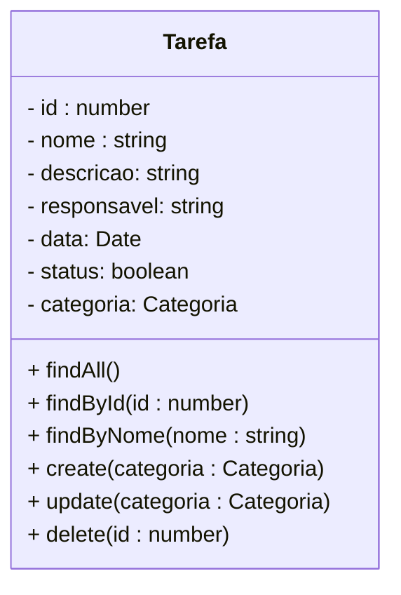

<h1>Projeto 02 - Todo-List - Classes TarefaController e TarefaService - Método Listar Tudo</h1>

O que veremos por aqui:

1. Criar a Classe TarefaService
2. Criar a Classe TarefaController
3. Criar o Método findAll() para listar todas as Tarefas
4. Registrar as 2 Classes no Módulo TarefaModule
5. Registrar o Módulo TarefaModule no Módulo APPModule
6. Testar o Método findAll() no Insomnia

<h2>1. O Módulo Tarefa</h2>

Na etapa anterior, começamos a construir o **Módulo Tarefa**, a partir da **Classe Entidade (Model) Tarefa**, onde implementamos todos os Atributos do recurso Tarefa e geramos a tabela **tb_tarefas** dentro do nosso Banco de dados **db_todolist**. Agora vamos começar a criar os Métodos do CRUD do recurso Tarefa, listados no Diagrama de Classes abaixo, nas Classes **TarefaService** e **TarefaController**.



Serão implementados 6 Métodos: 

- 3 Métodos de Busca (GET)
- 1 Método de Persistência dos Objetos no Banco de dados (POST)
- 1 Método de Atualização dos Objetos persistidos no Banco de dados (PUT)
- 1 Método para apagar Objetos persistidos no Banco de dados (DELETE)

A Classe **TarefaService** será a Classe de Serviço do Módulo Tarefa, ou seja, onde implementaremos os Métodos com as regras de negócio da aplicação. A Classe **TarefaController** será a Classe Controladora do Módulo Tarefa, ou seja, onde implementaremos os Métodos responsáveis por responder toda e qualquer Requisição (HTTP Request), que for enviada de fora da aplicação para o recurso Tarefa. 

> **Regras de negócio:**  O termo regras de negócio refere-se às **diretrizes que definem ou restringem as ações, mostrando como os Métodos devem funcionar, o que deve ser checado em cada Método e quais são os limites da aplicação**. Essas regras são importantes para que a pessoa desenvolvedora tenha uma visão clara do que deve ser feito, como e por qual razão.

Nós iremos implementar os Métodos do **CRUD** nas duas Classes, com os mesmos nomes, mas com responsabilidades diferentes. O Método da Classe de Serviço fará o processamento dos dados enviados na Requisição, enquanto O Método da Classe Controladora receberá as Requisições e enviará os dados para a Classe de Serviço. Após a conclusão do processamento da Requisição, A Classe Controladora enviará uma Resposta HTTP, definida a partir do retorno do Método da Classe de Serviço, além do resultado do processamento do Método da Classe de Serviço. 

<h2>👣 Passo 01 - Criar a Classe TarefaService</h2>

Vamos criar a pasta **services**, dentro do nosso **Módulo Tarefa** (pasta Tarefa):

1. Na pasta **Tarefa**, clique com o botão direito do mouse e clique na opção **New Folder** (Nova Pasta). 

<div align="center"></div>

2. O nome da pasta será **services**, como mostra a figura abaixo. Após digitar o nome da pasta, pressione a tecla **enter** do seu teclado para concluir. 

<div align="center"></div>

|  | <div align="left"> **ALERTA DE BSM:** *Mantenha a Atenção aos Detalhes ao criar a pasta services. Um erro muito comum é criar a pasta services fora da pasta da pasta tarefa.* </div> |
| ------------------------------------------------------------ | ------------------------------------------------------------ |

Na sequência, vamos criar a Classe de Serviço **TarefaService** que chamaremos de **tarefa.service.ts**

|  | <div align="left"> **ALERTA DE BSM:** *Mantenha a Atenção aos Detalhes ao criar Classe de Serviço. Um erro muito comum é digitar o nome da Classe de forma incorreta. O nome da Classe deve estar dentro dos padrões do Nest (nome_do_modulo.tipo_da_classe.ts) para evitar erros na sua aplicação.* </div> |
| ------------------------------------------------------------ | ------------------------------------------------------------ |

1. Clique com o botão direito do mouse sobre a **pasta services**, que foi criada dentro da pasta **tarefa**, como mostra a figura abaixo, e na sequência clique na opção **New File** (Novo Arquivo).

<div align="center"></div>

2. O nome do arquivo será **tarefa.service.ts**, como mostra a figura abaixo. Após digitar o nome do arquivo, pressione a tecla **enter** do seu teclado para concluir. 

<div align="center"></div>

Agora vamos começar a criar o código da Classe **TarefaService**, como mostra a figura abaixo. Como iremos construir 6 Métodos dentro da Classe de Serviço, vamos construir por partes. Aqui construiremos apenas o primeiro Método (**findAll()**), que tem como objetivo listar todas as Tarefas persistidas no Banco de dados.

<div align="center"></div>

Vamos analisar o código:

**Linha 1:** Importamos o pacote **Common** com os respectivos **decorators**, utilizados na implementação da Classe TarefaService.

**Linha 2:** Importamos o pacote **TypeORM** com os respectivos **decorators**, utilizados na implementação da Classe TarefaService.

**Linha 3:** Importamos a Classe **Repository**, do Módulo **typeorm**, do pacote **Typeorm**. 

**Linha 4:** Importamos a Classe Entidade **Tarefa**, do Módulo **Tarefa**.

**Linha 6:** O decorator **@Injectable** indica que a Classe é do tipo Service (Classe de Serviço), que pode ser Injetada em outras Classes através da **Injeção de Dependências**.

**Linha 9:** Cria um **Construtor**, que receberá as **Injeções de Dependência** necessárias para o desenvolvimento da Classe de Serviço.

**Linhas 10:** O decorator **@InjectRepository(Tarefa)** é a  implementação utilizada pelo TypeORM para  aplicar  a  **Inversão  de  Controle (IoC)**, sempre que for necessário. A Injeção de Dependência define quais Classes serão instanciadas automaticamente e em quais lugares serão "Injetadas" quando houver necessidade.

> **Inversão de controle:** ou IOC é um princípio de design de programas de computadores, onde a sequência de chamadas dos  Métodos é invertida em relação à programação tradicional, ou seja, ela  não é determinada diretamente pelo programador e sim pela Linguagem ou Framework. É a transferência da responsabilidade de Criar e Instanciar Objetos para a Linguagem ou Framework. A Injeção de Dependências é um tipo de Inversão de Controle.

Em nosso exemplo, a Classe de Serviço cria um ponto de injeção do tipo **Tarefa** e quando houver a necessidade o TypeORM cria um novo **Objeto da Classe Tarefa** através da Interface **Repository**. A grande vantagem de se utilizar a Injeção de Dependências é que você consegue instanciar e acessar os Objetos sem a necessidade de criar Métodos Construtores na Classe Entidade ou criar/instanciar Objetos de forma manual, semelhante ao que era feito nas Sessões de Programação Orientada à Objetos. Estamos transferindo esta responsabilidade para o TypeORM e desta forma nos preocuparemos apenas com o processamento das Requisições HTTP.

> A Interface **Repository** nos auxilia na interação com o Banco de dados. Esta Interface contém diversos  Métodos pré-implementados para a manipulação dos dados de uma Entidade, como os Métodos para salvar, deletar, listar e alterar dados dos objetos persistidos no Banco de dados (CRUD). Outra vantagem da Interface Repository é que os Métodos de consulta permitem criar qualquer consulta SQL que você precisar, de forma simples e rápida.

**Linha 11:** Definimos o nome do Objeto da Interface **Repository** (**TarefaRepository**), que será responsável por implementar a **Injeção de Dependências** e executar os Métodos da Interface Repository.

**Linha 14:** Criamos o Método Assíncrono (async), chamado **findAll()**, que promete retornar uma **Promise** contendo um array de Objetos da Classe Tarefa. Como o Método findAll() lista vários Objetos é necessário criar um array para armazenar todos os Objetos.

**Linha 15:** Retorna a execução do Método **find()**, da Interface **TarefaRepository**. Traçando um paralelo com o MySQL, o Método find() sem parâmetros seria o equivalente a instrução: <code>SELECT * FROM tb_tarefas;</code>, que lista todas as Tarefas da Tabela tb_tarefas. Observe que na instrução **return** foi inserido o comando **await** (aguarde), que na prática significa espere que a **Promise** seja resolvida (os Objetos Tarefa sejam inseridos no array de Objetos Tarefa da Promise), antes de retornar a execução do Método e o valor resolvido para a Classe que acionou o Método.

> **Promise:** É um objeto usado para processamento assíncrono. Uma Promise na prática é uma promessa, que representa um valor que pode estar disponível agora, no futuro ou nunca. Uma Promise é como um "procurador" para um valor que não é necessariamente conhecido quando a promessa é criada. Isso permite a associação de Métodos de tratamento para eventos da ação assíncrona num caso eventual de sucesso ou de falha. Isto permite que os Métodos assíncronos retornem valores como Métodos síncronos: ao invés do valor final, o Método assíncrono retorna uma *promessa* ao valor em algum momento no futuro.
>
> Uma Promise pode ter 3 estados: 
>
> - *pending* (pendente): Estado inicial, que não foi realizada nem rejeitada.
> - *fulfilled* (resolvida): sucesso na operação.
> - *rejected* (rejeitado):  falha na operação.

<div align="left"> <a href="https://docs.nestjs.com/providers" target="_blank"><b>Documentação: <i>Provedores - Classe de Serviço</i></b></a></div>

<div align="left"> <a href="https://docs.nestjs.com/fundamentals/custom-providers" target="_blank"><b>Documentação: <i>Provedores Customizados - Classe de Serviço</i></b></a></div>

<div align="left"> <a href="https://docs.nestjs.com/techniques/database" target="_blank"><b>Documentação: <i>Interface Repositório</i></b></a></div>

<div align="left"> <a href="https://typeorm.io/working-with-repository" target="_blank"><b>Documentação: <i>TypeORM - Repositórios</i></b></a></div>

<div align="left"> <a href="https://typeorm.io/find-options" target="_blank"><b>Documentação: <i>TypeORM - Método de busca find()</i></b></a></div>

<div align="left"> <a href="https://developer.mozilla.org/pt-BR/docs/Web/JavaScript/Reference/Global_Objects/Promise" target="_blank"><b>Documentação: Promise</b></a></div>

<div align="left"> <a href="https://developer.mozilla.org/pt-BR/docs/Web/JavaScript/Reference/Operators/async_function" target="_blank"><b>Documentação: Async</b></a></div>

<div align="left"> <a href="https://developer.mozilla.org/pt-BR/docs/Web/JavaScript/Reference/Operators/await" target="_blank"><b>Documentação: Await</b></a></div>

<br />

<div align="left"> <a href="https://github.com/rafaelq80/backend_todolist_nest/blob/04_Listar_Tarefas/todolist/src/tarefa/services/tarefa.service.ts" target="_blank"><b>Código fonte da Classe TarefaService</b></a>


<br />

<h2>👣 Passo 02 - Criar a Classe TarefaController</h2>

Vamos criar a pasta **controllers**, dentro do nosso **Módulo Tarefa** (pasta Tarefa):

1. Na pasta **tarefa**, clique com o botão direito do mouse e clique na opção **New Folder** (Nova Pasta). 

<div align="center"></div>

2. O nome da pasta será **controllers**, como mostra a figura abaixo. Após digitar o nome da pasta, pressione a tecla **enter** do seu teclado para concluir. 

<div align="center"></div>

|  | <div align="left"> **ALERTA DE BSM:** *Mantenha a Atenção aos Detalhes ao criar a pasta controllers. Um erro muito comum é criar a pasta controllers fora da pasta tarefa.* </div> |
| ------------------------------------------------------------ | ------------------------------------------------------------ |

Na sequência, vamos criar a Classe Controladora **TarefaController** que chamaremos de **tarefa.controller.ts**.

|  | <div align="left"> **ALERTA DE BSM:** *Mantenha a Atenção aos Detalhes ao criar Classe de Serviço. Um erro muito comum é digitar o nome da Classe de forma incorreta. O nome da Classe deve estar dentro dos padrões do Nest (nome_do_modulo.tipo_da_classe.ts) para evitar erros na sua aplicação.* </div> |
| ------------------------------------------------------------ | ------------------------------------------------------------ |

1. Clique com o botão direito do mouse sobre a **pasta controllers**, que foi criada dentro da pasta **tarefa**, como mostra a figura abaixo, e clique na opção **New File** (Novo Arquivo).

<div align="center"></div>

2. O nome do arquivo será **tarefa.controller.ts**, como mostra a figura abaixo. Após digitar o nome do arquivo, pressione a tecla **enter** do seu teclado para concluir. 

<div align="center"></div>

Agora vamos começar a criar o código da Classe **TarefaController**, como mostra a figura abaixo. Como iremos construir 6 Métodos dentro da Classe Controladora, vamos construir por partes. Aqui construiremos apenas o primeiro Método, o **findAll()**, que tem como objetivo executar o Método com o mesmo nome na **Classe TarefaService**.

<div align="left"></div>

Vamos analisar o código:

**Linha 1:** Importamos o pacote **Common** com os respectivos **decorators**, utilizados na implementação da Classe TarefaController.

**Linha 2:** Importamos a Classe **Tarefa**, do Módulo **Tarefa**.

**Linha 3:** Importamos a Classe **TarefaService**, do Módulo **Tarefa**.

**Linha 5:** O decorator **@Controller** indica que a Classe é do tipo **RestController**, que receberá requisições que serão compostas por:

- **URL:** Endereço da Requisição (**endpoint**)
- **Verbo:** Define qual Método HTTP será acionado na Classe controladora.
- **Corpo da Requisição (Request Body):** Objeto que contém os dados que serão persistidos no Banco de dados. Apenas as Requisições do tipo POST e PUT conseguem enviar dados no Corpo da Requisição.

Após receber e processar a Requisição, a Classe Controladora Responderá com:

- Um **Código de Status HTTP** pertinente a operação que está sendo realizada.
- O resultado do processamento (Objetos de uma Classe, por exemplo) inserido diretamente no corpo da resposta (**Response Body**)

O parâmetro inserido dentro dos parênteses é usado para mapear as solicitações para os Métodos da Classe controladora **TarefaController**, ou seja, definir a **URL** (endereço) padrão do Módulo (**/tarefas**). Ao digitar a URL do servidor seguida do caminho do Recurso (**http://localhost:4000/tarefas**), a Classe Controladora enviará a Requisição para a Classe associada à este endereço (TarefaController) e o Respectivo Método, de acordo com o caminho e o verbo HTTP (GET, POST, PUT ou DELETE).

|  | <div align="left"> **ALERTA DE BSM:** *Mantenha a Atenção aos Detalhes ao configurar a URL do Módulo. Observe que configuramos a URL (/tarefas) iniciando com uma barra, com letras minúsculas, usando o mesmo nome do módulo no plural, sem acentos, caracteres especiais e espaços em branco. Lembre-se que todos os endereços na WEB seguem este padrão.* </div> |
| ------------------------------------------------------------ | ------------------------------------------------------------ |

**Linha 7:** Cria um Construtor, que receberá as Injeções de Dependência. Como precisaremos ter acesso aos Métodos da **Classe TarefaService**, foi injetado um Objeto desta Classe dentro do Construtor.

**Linha 9:** O decorator **@Get()** mapeia todas as Requisições **HTTP GET**, enviadas para um endereço específico, chamado **endpoint**, dentro do Módulo Tarefa, para um Método específico que responderá a Requisição, ou seja, ele indica que o Método **findAll()**, responderá a todas as requisições do tipo **HTTP GET**, enviadas no endereço **http://localhost:4000/tarefas/**.

|  | <div align="left"> **ATENÇÃO:** *O Endereço do endpoint será igual ao Endereço do Módulo apenas quando o decorator @Get() não possuir um endereço personalizado, como um parâmetro por exemplo. Caso existam dois ou mais Métodos do tipo GET será necessário personalizar o endereço de cada Método anotado com @Get("/endereco").* </div> |
| ------------------------------------------------------------ | ------------------------------------------------------------ |

**Linha 10:** O decorator **@HttpCode(HttpStatus.OK)** indica que o Método **findAll()**, terá como **Resposta HTTP** padrão o HTTP Status **OK 🡪 200**, ou seja, quando a Resposta da Requisição for positiva, será retornado o **HTTP Status OK 🡪 200**. Caso a Resposta seja negativa (algo deu errado), a Resposta dependerá do erro.

**Linha 11:** Criamos o Método **findAll()**, que promete retornar uma **Promise** (que será enviada pela Classe TarefaService), contendo um array de Objetos Tarefa. 

**Linha 12:** Executa o Método **findAll()** (**Método da Classe TarefaService**), que retornará **todos os Objetos da Classe Tarefa** persistidos no Banco de dados dentro de um array. 

<div align="left"> <a href="https://developer.mozilla.org/pt-BR/docs/Web/HTTP/Methods" target="_blank"><b>Documentação: HTTP Request Methods</b></a></div>

<div align="left"> <a href="https://developer.mozilla.org/pt-BR/docs/Web/HTTP/Status" target="_blank"><b>Documentação: HTTP Status Code</b></a></div>

<div align="left"> <a href="https://docs.nestjs.com/controllers" target="_blank"><b>Documentação: <i>Classe Controladora</i></b></a></div>

<div align="left"> <a href="https://docs.nestjs.com/providers" target="_blank"><b>Documentação: <i>Provedores - Classe Controladora</i></b></a></div>

<br />

<div align="left"> <a href="https://github.com/rafaelq80/backend_todolist_nest/blob/04_Listar_Tarefas/todolist/src/tarefa/controllers/tarefa.controller.ts" target="_blank"><b>Código fonte da Classe TarefaController</b></a>

<br />

<h2>👣 Passo 03 - Registrar as Classes TarefaService e TarefaController na Classe TarefaModule</h2>

Na sequência, vamos registrar as nossas duas Classes (**TarefaService** e **TarefaController**), no Módulo **TarefaModule**. Esse passo é fundamental para o correto funcionamento da nossa aplicação.

1. Abra a Classe **TarefaModule**, localizada na pasta **tarefa**, conforme indicada na imagem abaixo:

<div align="center"></div>

2. Implemente as alterações, indicadas pelas setas na imagem abaixo:

<div align="left"></div>

Vamos analisar as alterações no código:

**Linha 1:** Importamos a Classe **TarefaController**, criada anteriormente. 

**Linha 2:** Importamos a Classe **TarefaService**, criada anteriormente. 

**Linha 9:** No array **providers** vamos adicionar a **Classe TarefaService** do **Módulo Tarefa**. Desta forma a Classe de Serviço poderá ser injetada em outras Classes dentro do Módulo.

**Linha 10:** No array **controllers** vamos adicionar a **Classe TarefaController** do **Módulo Tarefa**. Desta forma os endpoints da Classe Controladora estrão disponíveis para receber Requisições HTTP.

<div align="left"> <a href="https://docs.nestjs.com/modules" target="_blank"><b>Documentação: <i>Módulos no Nest</i></b></a></div>

<br />

<div align="left"> <a href="https://github.com/rafaelq80/backend_todolist_nest/blob/04_Listar_Tarefas/todolist/src/tarefa/tarefa.module.ts" target="_blank"><b>Código fonte da Classe TarefaModule</b></a></div>

<br />

<h2>👣 Passo 04 - Registrar o Módulo TarefaModule no Módulo AppModule</h2>

Para finalizar, vamos registrar a Classe **Tarefa** no Módulo principal da  aplicação, a Classe **AppModule**. 

1. Abra a Classe **AppModule**, localizada na pasta **src**, conforme indicada na imagem abaixo:

<div align="center"></div>

2. Implemente as duas alterações, indicadas pelas setas na imagem abaixo:

<div align="left"></div>

Vamos analisar o código:

**Linha 1:** Importamos o Módulo **TarefaModule**.

**Linha 18:** No array **imports** vamos inserir o Módulo **TarefaModule**.

|  | <div align="left"> **ATENÇÃO:** *Se o Módulo TarefaModule, não for registrado no Módulo principal da aplicação (AppModule), os endpoints da aplicação não ficarão disponíveis para serem consumidos pelo front-end.* </div> |
| ------------------------------------------------------------ | ------------------------------------------------------------ |

<br />

<div align="left"> <a href="https://docs.nestjs.com/modules" target="_blank"><b>Documentação: <i>Módulos no Nest</i></b></a></div>

<br />

<div align="left"> <a href="https://github.com/rafaelq80/backend_todolist_nest/blob/04_Listar_Tarefas/todolist/src/app.module.ts" target="_blank"><b>Código fonte da Classe AppModule</b></a></div>

<br />

<h2>👣 Passo 05 - Executar o projeto</h2>

1. Verifique se você está dentro da pasta do projeto, como mostra a figura abaixo:

<div align="center"></div>

2. Digite o comando ***npm run start:dev***, para compilar e executar o nosso projeto **todolist**. 

```bash
npm run start:dev
```

3. Se tudo deu certo, o resultado será semelhante ao da figura abaixo:

<div align="center"></div>

4. Observe na imagem acima, na região destacada em amarelo, que o endpoint do tipo **GET** , apontando para o caminho (rota) **/tarefas**, foi disponibilizado (mapeado).

<br />

<h2>👣 Passo 06 - Inserir dados no Banco de dados</h2>

Como ainda não criamos um Método para Cadastrar Tarefas (criaremos em breve), vamos inserir dois registros diretamente no Banco de Dados **db_todolist**  na Tabela **tb_tarefas** para testarmos o nosso Método **findAll()**.

1. Abra o <b>MySQL Workbench</b>.

1. Crie um novo arquivo SQL **(SQLFile)** e digite os comandos abaixo:


```sql
USE db_todolist;

INSERT INTO tb_tarefas(nome, descricao, responsavel, data, status)
VALUES ("Tarefa 01", "Descrição da Tarefa 01", "Responsável 01", "2022-07-22", true);

INSERT INTO tb_tarefas(nome, descricao, responsavel, data, status)
VALUES ("Tarefa 02", "Descrição da Tarefa 02", "Responsável 02", "2022-07-23", false);

SELECT * FROM tb_Tarefas;
```

3. Selecione todas as linhas e clique no primeiro raio  para inserir os dados na tabela **tb_tarefas**.

<div align="center"></div>

4. A imagem acima mostra que os dados foram inseridos com sucesso!

<br />

<h2>👣 Passo 07 - Testar no Insomnia</h2>

Para testar a aplicação, utilizaremos o **Insomnia**. 

Para organizar os nossos testes, vamos criar uma **Collection** para guardar todas as nossas **Requisições do Projeto Todo-List**. Na sequência vamos criar dentro da Collection uma pasta chamada **Tarefa** para guardar todas as requisições do Módulo Tarefa. Para concluir, vamos criar uma Requisição do tipo **GET**, dentro da pasta Tarefa, para testar o nosso Método **findAll()**.

<h3>7.1. Criando a Collection Todo-List</h3>

1. Na janela principal do **Insomnia**, clique no botão **Create** e clique na opção **Request Collection**.

<div align="center"></div>

2. Na janela que será aberta, informe o nome da Collection (**Todo-List**) e clique no botão **Create** para concluir. 

<div align="center"></div>

<h3>7.2. Criando a  Pasta Tarefa</h3>

Vamos criar dentro da **Collection Todo-List**, na **Pasta Tarefa**, que guardará todas as requisições do **Módulo Tarefa**.

1. Na **Collection Todo-List**, clique no botão . No menu que será aberto, clique na opção **New Folder**.

<div align="center"></div>

2. Na janela que será aberta, informe o nome da pasta (**Tarefa**) e clique no botão **Create** para concluir. 

<div align="center"></div>

<h3>7.3. Criando a  Requisição - Consultar todas as Tarefas - findAll()</h3>

Agora vamos criar a Requisição para o **Método findAll()**:

1. Clique com o botão direito do mouse sobre a **Pasta Tarefa** para abrir o menu e clique na opção **New Request**.

<div align="center"></div>

2. Será criada uma nova Requisição (New Request) dentro da pasta **Tarefa**.

<div align="center"></div>

3. Dê um duplo clique sobre a nova Requisição (**New Request**), informe o nome da Requisição (indicado na imagem abaixo na cor amarela) e pressione a tecla **enter** do seu teclado.

<div align="center"></div>

4. Selecione o Método HTTP que será utilizado (**GET**) na Requisição, indicado na imagem abaixo na cor verde. 

<div align="center"></div>

5. Configure o endereço da Requisição conforme a imagem abaixo:

<div align="center"></div>

6. No item marcado em amarelo na imagem acima, informe o endereço do endpoint da Requisição. A Requisição **Consultar Todas as Tarefas** foi configurada da seguinte maneira:

- A primeira parte do endereço (http://localhost:4000) é o endereço do nosso servidor local. Quando a aplicação estiver na nuvem, ele será substituído pelo endereço da nuvem (**Exemplo:** http://nomedaaplicacao.herokuapp.com).
- A segunda parte do endereço é o **endpoint** configurado no decorator ***@Controller()***, em nosso caso  **/tarefas**. 

7. Para testar a Requisição, com a aplicação rodando, clique no botão .

8. O resultado da Requisição você confere na imagem abaixo:

<div align="center"></div>

9. Observe que a aplicação além de exibir os dados de todos os Objetos da Classe Tarefa persistidos no Banco de dados, no Corpo da Resposta. Ela também retornará um **HTTP Status 200 🡪 OK** (indicado em verde na imagem acima), informando que a Requisição foi bem sucedida!

<div align="left"><a href="https://docs.insomnia.rest/" target="_blank"><b>Documentação: Insomnia Rest</b></a></div>

<div align="left"><a href="https://www.json.org/json-pt.html" target="_blank"><b>Documentação: Padrão JSON</b></a></div>

<br />

<div align="left"> <a href="https://github.com/rafaelq80/backend_todolist_nest/tree/04_Listar_Tarefas" target="_blank"><b>Código fonte do projeto</b></a></div>

<br /><br />

<div align="left"><a href="README.md">Voltar</a></div>