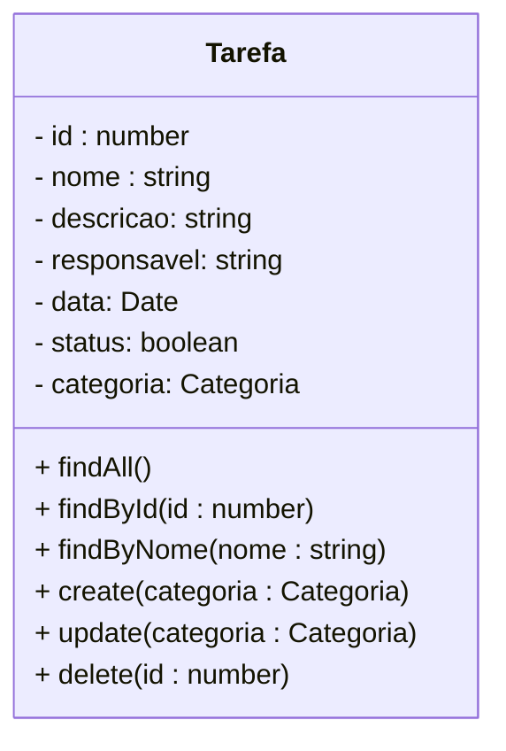

<h1>Projeto 02 - Todo-List - Classe TarefaController e TarefaService - Método Consultar por Nome</h1>

O que veremos por aqui:

1. Criar o Método findByNome(nome: string) na Classe TarefaService
1. Criar o Método findByNome(id: string) na Classe TarefaController
1. Testar o Método no Insomnia

<h2>1. O Módulo Tarefa</h2>

Nas etapas anteriores, começamos a construir as Classes **TarefaService** e **TarefaController** e implementamos os Métodos:

- **findAll()**  🡪 Retorna todos os Objetos da Classe Tarefa persistidos no Banco de dados.
- **findById(id: number)** 🡪 Retorna um Objeto específico da Classe Tarefa persistidos no Banco de dados. A Tarefa é identificada pelo atributo id.

Vamos continuar a construção das nossas duas Classes implementando o **Método findByNome( nome: string )**, que retornará todos os Objetos da Classe Tarefa persistidos no Banco  de dados, cujo atributo nome contenha a string enviada no parâmetro  nome do Método.



<h2>👣 Passo 01 - Criar o Método findByNome(nome: string) na Classe TarefaService</h2>

Vamos implementar o Método **findByNome(nome: string)** na Classe TarefaService. Traçando um paralelo com o MySQL, seria o equivalente a instrução: <code>SELECT * FROM tb_tarefas where nome like "%nome%";</code>.

1. Abra a Classe **Tarefa Service**, localizada na pasta **src/tarefa/services**.

<div align="center"></div>

2. Insira o código abaixo depois do Método **findById(id: number)**.

<div align="left"></div>

Vamos analisar o código do Método:

**Linha 31:** Criamos o Método Assíncrono (async), chamado **findByNome(nome: string)**, que promete retornar uma **Promise** contendo um array de Objetos da Classe Tarefa. Como o **Método findByNome(nome: string)** lista todos os Objetos que atendam ao critério da consulta, assim como no Método findAll(), será necessário criar um array para armazenar todos os Objetos encontrados.

Observe que o Método **findByNome(nome: string)** possui um parâmetro do tipo **string**, chamado **nome**. Esta variável receberá a string que você deseja procurar no Atributo nome de todas as Postagens persistidas. Qualquer tarefa, cujo **Atributo nome contenha a string enviada no parâmetro** (seja no inicio, no meio ou no fim), será adicionada no array e exibida no resultado do Método. O parâmetro nome será enviado pelo Método da **Classe TarefaController**. 

**Linha 32:** Retorna a execução do Método **find()**, da Interface **tarefaRepository**. O resultado da execução do Método **find()**, será um array de Objetos Tarefa, selecionados de acordo com o(s) critério(s) da clausula where.  

Observe que na instrução **return** foi inserido o comando **await** (aguarde), que na prática significa espere que a **Promise** seja resolvida (os Objetos Tarefa sejam encontrados), antes de retornar a execução do Método e o valor resolvido para a Classe que acionou o Método.

**Linhas 33 e 34:** Declaramos a clausula where, com o critério **ILike(`%${nome}%`)**, ou seja, **localize a Tarefa cujo atributo nome contenha, em qualquer parte, a string nome enviada no parâmetro do Método findByNome(nome: string)**. 

Observe que na consulta acima, utilizamos a clausula **ILike** ao invés do tradicional **Like**. A diferença entre eles é a seguinte:

| Clausula  | Descrição                                                    |
| --------- | ------------------------------------------------------------ |
| **Like**  | O Like não ignora se a string está em maiúsculo ou minúsculo, ou seja, ele faz uma busca literal. <br />**Exemplo:** GENERATION é diferente de generation. |
| **ILike** | O ILike (Insensitive Like), ignora se a string foi digitada com letras maiúsculas ou minúsculas. Na prática o que o ILike faz é converter a string digitada e o conteúdo do Atributo para letras maiúsculas e só então ele compara as duas.<br />**Exemplo:** GENERATION é igual a generation. |

3. Após a implementação do Método **findByNome(nome: string)**, observe que a linha 3 do código, será atualizada com um novo pacote, como mostra a figura abaixo (indicado pela seta amarela):

<div align="left"></div>

<div align="left"> <a href="https://docs.nestjs.com/providers" target="_blank"><b>Documentação: <i>Provedores - Classe de Serviço</i></b></a></div>

<div align="left"> <a href="https://docs.nestjs.com/fundamentals/custom-providers" target="_blank"><b>Documentação: <i>Provedores Customizados - Classe de Serviço</i></b></a></div>

<div align="left"> <a href="https://typeorm.io/find-options" target="_blank"><b>Documentação: <i>TypeORM - Método de busca find()</i></b></a></div>

<div align="left"> <a href="https://developer.mozilla.org/pt-BR/docs/Web/JavaScript/Reference/Global_Objects/Promise" target="_blank"><b>Documentação: Promise</b></a></div>

<div align="left"> <a href="https://developer.mozilla.org/pt-BR/docs/Web/JavaScript/Reference/Operators/async_function" target="_blank"><b>Documentação: Async</b></a></div>

<div align="left"> <a href="https://developer.mozilla.org/pt-BR/docs/Web/JavaScript/Reference/Operators/await" target="_blank"><b>Documentação: Await</b></a></div>

<br />

<div align="left"> <a href="https://github.com/rafaelq80/backend_todolist_nest/blob/06_Listar_Tarefas_por_nome/todolist/src/tarefa/services/tarefa.service.ts" target="_blank"><b>Código fonte da Classe TarefaService</b></a>
<br /><br />


<h2>👣 Passo 02 - Criar o Método findByNome(nome: string) na Classe TarefaController</h2>

Vamos implementar o Método **findByNome(nome: string)** na Classe TarefaController, que tem como objetivo executar o Método com o mesmo nome na Classe de Serviço TarefaService. 

1. Abra a Classe **TarefaController**, localizada na pasta **src/tarefa/controllers**.

<div align="center"></div>

2. Insira o código depois do Método **findById(id: number)**.

<div align="left"></div>

Vamos analisar o código do Método:

**Linha 21:** O decorator **@Get('/nome/:nome')** mapeia todas as Requisições **HTTP GET**, enviadas para um endereço específico **(/nome/:nome)**, chamado **endpoint**, dentro do Módulo Tarefa, para um Método específico que responderá a Requisição, ou seja, ele indica que o Método **findByNome(@Param('nome') nome: string)**, responderá a todas as requisições do tipo **HTTP GET**, enviadas no endereço **http://localhost:4000/tarefas/nome/:nome**, onde **:nome** é o critério de busca da consulta.

|  | <div align="left"> **ATENÇÃO:** *O Endereço deste Endpoint será composto pelo Endereço do Módulo (/tarefas) + a variável de caminho indicada no decorator @Get (/nome/:nome). Lembre-se que não pode existir dois ou mais métodos do tipo GET com o mesmo endereço.* </div> |
| ------------------------------------------------------------ | ------------------------------------------------------------ |

**Linha 22:** O decorator **@HttpCode(HttpStatus.OK)** indica que o Método **findByNome(@Param('nome') nome: string)**, terá como **Resposta HTTP** padrão **OK 🡪 200**, ou seja, quando a Resposta da Requisição for positiva, o status  **OK 🡪 200**. Caso a Resposta seja negativa (algo deu errado), a Resposta dependerá do erro.

**Linha 23:** Criamos o Método **findByNome(@Param('nome') nome: string)**, que promete retornar uma **Promise** (que será enviada pela Classe TarefaService), com um array de Objetos da Classe Tarefa. 

**@Param('nome'):** Este decorator **insere o valor enviado na variável de caminho nome (:nome)**, no parâmetro do Método **findByNome(@Param('nome') nome: string)**;

**Exemplo:**

http://localhost:4000/tarefas/nome/palavra

Neste exemplo, o parâmetro **nome: string**, do Método **findByNome(@Param('nome') nome: string)**, receberá a string **"palavra"** (parâmetro que será enviado para a Classe TarefaService), que foi inserido na variável de caminho **/:nome**.

|  | <div align="left"> **ATENÇÃO:** *Por questões de boas práticas e legibilidade do código, a Variável de Caminho e o Parâmetro do Método devem possuir o mesmo nome.* </div> |
| ------------------------------------------------------------ | ------------------------------------------------------------ |

**Linha 24:** Executa o método **findByNome(nome: string)**, **Método da Classe TarefaService**, que retornará **um array de Objetos da Classe Tarefa**, persistido no Banco de dados, segundo o critério de busca implementado. 

<br />

<div align="left"> <a href=" https://developer.mozilla.org/pt-BR/docs/Web/HTTP/Methods" target="_blank"><b>Documentação: HTTP Request Methods</b></a></div>

<div align="left"> <a href=" https://developer.mozilla.org/pt-BR/docs/Web/HTTP/Status" target="_blank"><b>Documentação: HTTP Status Code</b></a></div>

<div align="left"> <a href="https://docs.nestjs.com/controllers" target="_blank"><b>Documentação: <i>Classe Controladora</i></b></a></div>

<div align="left"> <a href="https://docs.nestjs.com/providers" target="_blank"><b>Documentação: <i>Provedores - Classe Controladora</i></b></a></div>

<br />

<div align="left"> <a href="https://github.com/rafaelq80/backend_todolist_nest/blob/06_Listar_Tarefas_por_nome/todolist/src/tarefa/controllers/tarefa.controller.ts" target="_blank"><b>Código fonte da Classe TarefaController</b></a></div>

<br />


<h2>👣 Passo 03 - Executar o projeto</h2>

1. Verifique se você está dentro da pasta do projeto, como mostra a figura abaixo:

<div align="center"></div>

2. Digite o comando ***npm run start:dev***, para compilar e executar o nosso projeto **blogpessoal**, caso não esteja em execução. 

```bash
npm run start:dev
```

3. Se tudo deu certo, observe na imagem abaixo, na região indicada em amarelo, que o endpoint do tipo **GET**, apontando para o caminho (rota) **/tarefas/nome/:nome**, foi disponibilizado.

<div align="center"></div>

<br />

<h2>👣 Passo 04 - Testar no Insomnia</h2>

Agora vamos criar a Requisição para o Método **findByNome(nome: string)**:

1. Clique com o botão direito do mouse sobre a **Pasta Tarefa** para abrir o menu e clique na opção **New Request**.

<div align="center"></div>

2.  Será criada uma nova Requisição (New Request) dentro da pasta **Tarefa**.

<div align="center"></div>

3. Dê um duplo clique sobre a nova Requisição (**New Request**), informe o nome da Requisição (indicado na imagem abaixo na cor amarela) e pressione a tecla **enter** do seu teclado.

<div align="center"></div>

4. Selecione o Método HTTP que será utilizado (**GET**) na Requisição, indicado na imagem abaixo na cor verde. 

<div align="center"></div>

5. Configure o endereço da Requisição conforme a imagem abaixo:

<div align="center"></div>

6. No item marcado em amarelo na imagem acima, informe o endereço (endpoint) da Requisição. A Requisição **Consultar Tarefa por Nome** foi configurada da seguinte maneira:

- A primeira parte do endereço (http://localhost:4000) é o endereço do nosso servidor local. Quando a aplicação estiver na nuvem, ele será substituído pelo endereço da nuvem (Exemplo: http://nomedaaplicacao.herokuapp.com).
- A segunda parte do endereço é o **endpoint** configurado no Decorator ***@Controller***, em nosso caso **/tarefas**.  
- A terceira parte (**/nome**) é a variável de caminho (**@Param('nome')**) **nome**. Informe a palavra, frase ou letra que você deseja procurar.

7. Para testar a Requisição, com a aplicação rodando, clique no botão .

8. O resultado da Requisição você confere na imagem abaixo:

<div align="center"></div>

9. Observe que a aplicação além de exibir os dados de todos os Objetos da Classe Tarefa persistidos no Banco de dados, no Corpo da Resposta, respeitando o critério informado na consulta (palavra tarefa), ela também retornará um **HTTP Status 200 🡪 OK** (indicado em verde na imagem acima), informando que a Requisição foi bem sucedida!

<br />

<div align="left"> <a href="https://github.com/rafaelq80/backend_todolist_nest/tree/06_Listar_Tarefas_por_nome" target="_blank"><b>Código fonte do projeto</b></a></div>

<br /><br />

<div align="left"><a href="README.md">Voltar</a></div>