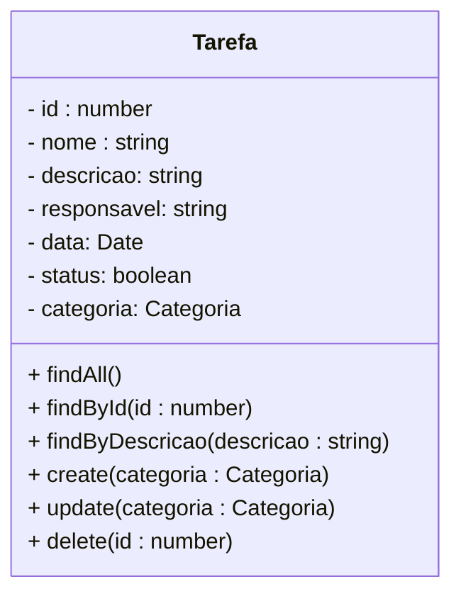

<h1>Projeto 02 - Todo-List - Classe TarefaController e TarefaService - Métodos Cadastrar e Atualizar</h1>

O que veremos por aqui:

1. Criar o Método create(tarefa: Tarefa) na Classe TarefaService
2. Criar o Método create(tarefa: Tarefa) na Classe TarefaController
3. Criar o Método update(tarefa: Tarefa) na Classe TarefaService
4. Criar o Método update(tarefa: Tarefa) na Classe TarefaController
5. Testar os Métodos no Insomnia

<h2>1. O Módulo Tarefa</h2>

Nas etapas anteriores, começamos a construir as Classes **TarefaService** e **TarefaController** e implementamos os seguintes Métodos:

-  **findAll()**  🡪 Retorna todos os Objetos da Classe Tarefa persistidos no Banco de dados.
-  **findById(id: number)** 🡪 Retorna um Objeto específico da Classe Tarefa persistido no Banco de dados. A Tarefa é identificada pelo Atributo id. 
-  **findByNome(nome: string)** 🡪 Retorna  todos os Objetos da Classe Tarefa persistidos no Banco de dados, cujo Atributo nome contenha (em qualquer parte) a String enviada no parâmetro nome do Método.   

Vamos continuar a construção das Classes **TarefaService** e **TarefaController** implementando os Métodos **create(tarefa: Tarefa)**, que persistirá um novo Objeto da Classe Tarefa no Banco de dados e  **update(tarefa: Tarefa)**, que atualizará um Objeto da Classe Tarefa persistido no Banco de dados.



<h2>👣 Passo 01 - Criar o Método create(tarefa: Tarefa) na Classe TarefaService</h2>

Vamos implementar o Método **create(tarefa: Tarefa)** na Classe TarefaService. Traçando um paralelo com o MySQL, seria o equivalente a instrução: <code>INSERT INTO tb_tarefas(nome, descricao, responsavel, data, status)
VALUES ("Tarefa", "Descrição da Tarefa", "Responsável", "2022-07-22", true);</code>.

1. Abra a Classe **Tarefa Service**, localizada na pasta **src/tarefa/services**.

<div align="center"></div>

2. Insira o código abaixo depois do Método **findByNome(nome: string)**.

<div align="left"></div>

Vamos analisar o código do Método:

**Linha 39:** Criamos o Método Assíncrono (async), chamado **create(tarefa: Tarefa)**, que promete retornar uma **Promise** contendo um Objeto da Classe Tarefa, que foi persistido no Banco de dados da aplicação. 

Observe que o Método **create(tarefa: Tarefa)** possui um parâmetro do tipo **Tarefa**, chamado **tarefa**. Esta variável receberá um Objeto da Classe Tarefa, que foi enviado no Corpo da Requisição (Request Body), conforme as regras definidas na Entidade Tarefa (Tamanho, Pode ser Nulo, Pode ser vazio, entre outras). O Objeto tarefa será enviado pelo Método da **Classe TarefaController**, através de um **JSON**, semelhante ao exemplo abaixo: 

```json
{
    "nome" : "Tarefa 03",
    "descricao" :"Descrição da Tarefa 03",
    "responsavel" : "Responsável 03",
    "data" : "2022-07-25",
    "status" : true
}
```

Observe que o Atributo **id não será informado porquê será atribuído pelo Banco de dados** após o Objeto ser persistido no Banco de dados.

**Linha 40:** Retorna a execução do Método **save()**, da Interface **tarefaRepository**. O resultado da execução do Método **save()**, será um Objeto da Classe Tarefa persistido (salvo) no Banco de dados, na tabela **tb_tarefas**.  

Observe que na instrução **return** foi inserido o comando **await** (aguarde), que na prática significa espere que a **Promise** seja resolvida (o Objeto Tarefa seja persistido), antes de retornar a execução do Método e o valor resolvido para a Classe que acionou o Método.

No caso de uma persistência dos dados, o retorno esperado do Método **save()** será a confirmação do Objeto persistido, no formato JSON, como mostra o exemplo abaixo:

```json
{
    "id" : 3,
	"nome": "Tarefa 03",
	"descricao": "Descrição da Tarefa 03",
	"responsavel": "Responsável 03",
	"data": "2022-07-25",
	"status": true
}
```

<div align="left"> <a href="https://docs.nestjs.com/providers" target="_blank"><b>Documentação: <i>Provedores - Classe de Serviço</i></b></a></div>

<div align="left"> <a href="https://docs.nestjs.com/fundamentals/custom-providers" target="_blank"><b>Documentação: <i>Provedores Customizados - Classe de Serviço</i></b></a></div>

<div align="left"> <a href="https://typeorm.io/find-options" target="_blank"><b>Documentação: <i>TypeORM - Método de busca find()</i></b></a></div>

<div align="left"> <a href="https://developer.mozilla.org/pt-BR/docs/Web/JavaScript/Reference/Global_Objects/Promise" target="_blank"><b>Documentação: Promise</b></a></div>

<div align="left"> <a href="https://developer.mozilla.org/pt-BR/docs/Web/JavaScript/Reference/Operators/async_function" target="_blank"><b>Documentação: Async</b></a></div>

<div align="left"> <a href="https://developer.mozilla.org/pt-BR/docs/Web/JavaScript/Reference/Operators/await" target="_blank"><b>Documentação: Await</b></a></div>

<br />

<div align="left"> <a href="https://github.com/rafaelq80/backend_todolist_nest/blob/07_Cadastrar_Atualizar_Tarefas/todolist/src/tarefa/services/tarefa.service.ts" target="_blank"><b>Código fonte da Classe TarefaService</b></a></div>

<br /><br />


<h2>👣 Passo 02 - Criar o Método create(tarefa: Tarefa) na Classe TarefaController</h2>

Vamos implementar o Método **create(@Body() tarefa: Tarefa)** na Classe TarefaController, que tem como objetivo executar o Método com o mesmo nome na Classe de Serviço TarefaService. 

1. Abra a Classe **TarefaController**, localizada na pasta **src/tarefa/controllers**.

<div align="center"></div>

2. Insira o código depois do Método **findByNome(nome: string)**.

<div align="left"></div>

Vamos analisar o código do Método:

**Linha 27:** O decorator **@Post()** mapeia todas as Requisições **HTTP POST**, enviadas para um endereço específico, chamado **endpoint**, dentro do Módulo Tarefa, para um Método específico que responderá a Requisição, ou seja, ele indica que o Método **create(@Body() tarefa: Tarefa)**, responderá a todas as requisições do tipo **HTTP POST**, enviadas no endereço **http://localhost:4000/tarefas/**.

|  | <div align="left"> **ATENÇÃO:** *O Endereço do endpoint do Método create(@Body() tarefa: Tarefa) será igual ao endereço do Método findAll(). Como os verbos HTTP dos dois Métodos são diferentes, o mesmo endereço pode ser de utilizado.* </div> |
| ------------------------------------------------------------ | ------------------------------------------------------------ |

**Linha 28:** O decorator **@HttpCode(HttpStatus.CREATED)** indica que o Método **create(@Body() tarefa: Tarefa)**, terá como **Resposta HTTP** padrão o status **CREATED 🡪 201**, ou seja, quando a Resposta da Requisição for positiva (o Objeto for persistido no Banco de dados), será retornado o **HTTP Status CREATED 🡪 201**. Caso a Resposta seja negativa (algo deu errado), a Resposta dependerá do erro.

**Linha 29:** Criamos o Método **create(@Body() tarefa: Tarefa)**, que promete retornar uma **Promise**, que será enviada pela Classe TarefaService, contendo um Objeto da Classe Tarefa. 

**@Body():** Este decorator **insere o Objeto tarefa enviado no corpo da Requisição**, no Objeto tarefa (parâmetro) do Método **create(@Body() tarefa: Tarefa)**;

**Linha 30:** Executa o Método **create(tarefa: Tarefa)**, **Método da Classe TarefaService**, que retornará o Objeto da Classe Tarefa persistido no Banco de dados. 

3. Após a implementação do Método **create(@Body() tarefa: Tarefa)**, observe que a linha 1 do código será atualizada com alguns novos pacotes, como mostra a figura abaixo (indicado em amarelo):

<div align="left"></div>

<br />

<div align="left"> <a href=" https://developer.mozilla.org/pt-BR/docs/Web/HTTP/Methods" target="_blank"><b>Documentação: HTTP Request Methods</b></a></div>

<div align="left"> <a href=" https://developer.mozilla.org/pt-BR/docs/Web/HTTP/Status" target="_blank"><b>Documentação: HTTP Status Code</b></a></div>

<div align="left"> <a href="https://docs.nestjs.com/controllers" target="_blank"><b>Documentação: <i>Classe Controladora</i></b></a></div>

<div align="left"> <a href="https://docs.nestjs.com/providers" target="_blank"><b>Documentação: <i>Provedores - Classe Controladora</i></b></a></div>

<br />

<div align="left"> <a href="https://github.com/rafaelq80/backend_todolist_nest/blob/07_Cadastrar_Atualizar_Tarefas/todolist/src/tarefa/controllers/tarefa.controller.ts" target="_blank"><b>Código fonte da Classe TarefaController</b></a></div>

<br /><br />


<h2>👣 Passo 03 - Executar o projeto</h2>

1. Verifique se você está dentro da pasta do projeto, como mostra a figura abaixo:

<div align="center"></div>

2. Digite o comando ***npm run start:dev***, para compilar e executar o nosso projeto **blogpessoal**, caso não esteja em execução. 

```bash
npm run start:dev
```

3. Se tudo deu certo, observe na imagem abaixo, na região indicada em amarelo, que o endpoint do tipo **POST**, apontando para o caminho (rota) **/tarefas**, foi disponibilizado.

<div align="center"></div>

<br />


<h2>👣 Passo 04 - Testar o Método create no Insomnia</h2>

Agora vamos criar a Requisição para o **Método create(tarefa: Tarefa)**:


1. Clique com o botão direito do mouse sobre a **Pasta Tarefa** para abrir o menu e clique na opção **New Request**.

<div align="center"></div>

2.  Será criada uma nova Requisição (New Request) dentro da pasta **Tarefa**.

<div align="center"></div>

3. Dê um duplo clique sobre a nova Requisição (**New Request**), informe o nome da Requisição (indicado na imagem abaixo na cor amarela) e pressione a tecla **enter** do seu teclado.

<div align="center"></div>

4. Selecione o Método HTTP que será utilizado (**POST**) na Requisição, indicado na imagem abaixo na cor verde. 

<div align="center"></div>

5. No item **Body**, vamos alterar para **JSON**, como mostra a imagem abaixo. Desta forma poderemos enviar os dados do Objeto Tarefa no Corpo da Requisição, no formato JSON.

<div align="center"></div>

6. Observe que o item **Body** será renomeado para **JSON**, como mostra a imagem abaixo:

<div align="center"></div>

7. Configure o endereço da Requisição conforme a imagem abaixo: 

<div align="center"></div>

8. No item marcado em amarelo na imagem acima, informe o endereço (endpoint) da Requisição. A Requisição **Cadastrar Tarefa** foi configurada da seguinte maneira:

- A primeira parte do endereço (http://localhost:4000) é o endereço do nosso servidor local. Quando a aplicação estiver na nuvem, ele será substituído pelo endereço da nuvem (**Exemplo:** http://nomedaaplicacao.herokuapp.com).
- A segunda parte do endereço é o **endpoint** configurado no decorator ***@Controller***, em nosso caso **/tarefas**.  

4. Na guia **JSON**, precisamos inserir um **JSON** com os dados que serão inseridos na nova tarefa. Lembrando que no padrão JSON: **o texto antes dos 2 pontos** (:) é o **Atributo** da Classe e **o texto depois dos 2 pontos** (:) é o **dado** que será cadastrado no Atributo.  Os Atributos são separados por virgula, como mostra a imagem acima.

   |  | <div align="left"> **ATENÇÃO:** Observe que no Método **POST não é necessário enviar o Atributo id** (será gerado pelo Banco de dados) no JSON.</div> |
   | ------------------------------------------------------------ | ------------------------------------------------------------ |

5. Para testar a Requisição, com a aplicação rodando, clique no botão .

6. O resultado da Requisição você confere na imagem abaixo:

<div align="center"></div>

8. Observe que a aplicação retorna além dos dados que foram persistidos no Banco de dados com o id, ela também retorna um **HTTP Status 201 🡪 CREATED** (indicado em verde na imagem acima). Este Status indica que a Requisição foi bem sucedida!

9. Caso os Atributos **nome**,  **descricao** ou **responsavel** sejam nulos ou em branco (indicado em amarelo), ou no Atributo **nome** seja enviada uma string com mais de 30 caracteres, a aplicação retornará o **HTTP Status 400 🡪 BAD_REQUEST** (indicado em verde), devido as validações que foram inseridas na Classe Tarefa (**@IsNotEmpty** e **@MaxLength(30)**), como mostra a imagem abaixo:

<div align="center"></div>

<br />

<h2>👣 Passo 05 - Criar o Método update(tarefa: Tarefa) na Classe TarefaService</h2>

Vamos implementar o Método **update(tarefa: Tarefa)** na Classe TarefaService. Traçando um paralelo com o MySQL, seria o equivalente a instrução: <code>UPDATE tb_tarefas SET nome="Nome", descricao="Descrição", responsavel="Responsável", data="2022-07-26", status=true WHERE id = id;</code>.

1. Abra a Classe **Tarefa Service**, localizada na pasta **src/tarefa/services**.

<div align="center"></div>

2. Insira o código depois do Método **create(@Body() tarefa: Tarefa)**.

<div align="left"></div>

Vamos analisar o código do Método:

**Linha 43:** Criamos o Método Assíncrono (async), chamado **update(tarefa: Tarefa)**, que promete retornar uma **Promise** contendo um Objeto da Classe Tarefa, que foi atualizado no Banco de dados da aplicação. 

Observe que o Método **update(tarefa: Tarefa)** possui um parâmetro do tipo **Tarefa**, chamado **tarefa**. Esta variável receberá um Objeto da Classe Tarefa, que será enviado no Corpo da Requisição (Request Body), conforme as regras definidas na Entidade Tarefa (Tamanho, Pode ser Nulo, Pode ser vazio, entre outras). O Objeto tarefa será enviado pelo Método da **Classe TarefaController**, através de um **JSON**, semelhante ao exemplo abaixo: 

```json
{
    "id" : 3,
    "nome" : "Tarefa 03 - Atualizada",
    "descricao" :"Descrição da Tarefa 03 - Atualizada!",
    "responsavel" : "Responsável 03",
    "data" : "2022-07-25",
    "status" : true
}
```

Observe que dieferente do Método **create(tarefa: Tarefa)**, **o id também deve ser enviado para identificar a tarefa que será atualizada**. 

**Linha 44:** Criamos um Objeto da Classe Tarefa, chamado **buscaTarefa**, para receber o resultado da execução do Método **findById(id: number)**, da Classe **TarefaService**. O objetivo é checar se a Tarefa que será atualizada existe, através da busca pelo id.  Observe que na chamada do Método **findById(id: number)** foi inserido o comando **await** (aguarde), que na prática significa espere que a **Promise** seja resolvida (o Objeto Tarefa seja encontrado), antes de retornar a execução do Método e o valor resolvido para a Classe que acionou o Método.

**Linha 46:** Verifica se **buscaTarefa é nulo** ou se o **id da tarefa(JSON) é nulo**. Caso o usuário digite um id que não exista, o Objeto buscaTarefa será nulo, causando um erro na nossa aplicação. Caso o usuário não informe o valor do Atributo id no Objeto tarefa (JSON), que foi enviado no Corpo da Requisição, será criado um novo Objeto, com um novo id. Estas duas checagens são para evitar estes dois erros.

**Linha 47:** Se o Objeto buscaTarefa ou o Atributo id do Objeto tarefa(JSON) for nulo, será retornado o HTTP Status **NOT FOUND 🡪 404** (Não Encontrado!).

**Linha 49:** Retorna a execução do Método **save()**, da Interface **tarefaRepository**. O resultado da execução do Método **save()**, será um Objeto da Classe Tarefa atualizado no Banco de dados, na tabela **tb_tarefas**. 

Observe que na instrução **return** foi inserido o comando **await** (aguarde), que na prática significa espere que a **Promise** seja resolvida (os Objetos Tarefa sejam atualizados), antes de retornar a execução do Método e o valor resolvido para a Classe que acionou o Método.

No caso de uma atualização dos dados, o retorno esperado do Método **save()** será a confirmação do Objeto persistido com as atualizações, no formato JSON, como mostra o exemplo abaixo:

```json
{
	"id": 3,
	"nome": "Tarefa 03 - Atualizada",
	"descricao": "Descrição da Tarefa 03 - Atualizada!",
	"responsavel": "Responsável 03",
	"data": "2022-07-25",
	"status": true
}
```

<div align="left"> <a href="https://docs.nestjs.com/providers" target="_blank"><b>Documentação: <i>Provedores - Classe de Serviço</i></b></a></div>

<div align="left"> <a href="https://docs.nestjs.com/fundamentals/custom-providers" target="_blank"><b>Documentação: <i>Provedores Customizados - Classe de Serviço</i></b></a></div>

<div align="left"> <a href="https://typeorm.io/find-options" target="_blank"><b>Documentação: <i>TypeORM - Método de busca find()</i></b></a></div>

<div align="left"> <a href="https://developer.mozilla.org/pt-BR/docs/Web/JavaScript/Reference/Global_Objects/Promise" target="_blank"><b>Documentação: Promise</b></a></div>

<div align="left"> <a href="https://developer.mozilla.org/pt-BR/docs/Web/JavaScript/Reference/Operators/async_function" target="_blank"><b>Documentação: Async</b></a></div>

<div align="left"> <a href="https://developer.mozilla.org/pt-BR/docs/Web/JavaScript/Reference/Operators/await" target="_blank"><b>Documentação: Await</b></a></div>

<br />

<div align="left"> <a href="https://github.com/rafaelq80/backend_todolist_nest/blob/07_Cadastrar_Atualizar_Tarefas/todolist/src/tarefa/services/tarefa.service.ts" target="_blank"><b>Código fonte da Classe TarefaService</b></a></div>

<br />

<h2>👣 Passo 06 - Criar o Método update(tarefa: Tarefa) na Classe TarefaController</h2>

Vamos implementar o Método **update(@Body() tarefa: Tarefa)** na Classe TarefaController, que tem como objetivo executar o Método com o mesmo nome na Classe de Serviço TarefaService. 

1. Abra a Classe **TarefaController**, localizada na pasta **src/tarefa/controllers**.

<div align="center"></div>

2. Insira o código depois do Método **create(@Body() tarefa: Tarefa)**.

<div align="left"></div>

Vamos analisar o código do Método:

**Linha 33:** O decorator **@Put()** mapeia todas as Requisições **HTTP PUT**, enviadas para um endereço específico, chamado **endpoint**, dentro do Módulo Tarefa, para um Método específico que responderá a Requisição, ou seja, ele indica que o Método **update(@Body() tarefa: Tarefa)**, responderá a todas as requisições do tipo **HTTP PUT**, enviadas no endereço **http://localhost:4000/tarefas/**.

|  | <div align="left"> **ATENÇÃO:** *O Endereço do endpoint do Método update(@Body() tarefa: Tarefa) será igual ao endereço do Método findAll() e do Método create(@Body() tarefa: Tarefa). Como os verbos HTTP dos três Métodos são diferentes, o mesmo endereço pode ser utilizado.* </div> |
| ------------------------------------------------------------ | ------------------------------------------------------------ |

**Linha 34:** O decorator **@HttpCode(HttpStatus.OK)** indica que o Método **update(@Body() tarefa: Tarefa)**, terá como **Resposta HTTP** padrão **OK 🡪 200**, ou seja, quando a Resposta da Requisição for positiva, será retornado o **HTTP Status OK 🡪 200**. Caso a Resposta seja negativa (algo deu errado), a Resposta dependerá do erro.

**Linha 35** Criamos o Método **update(@Body() tarefa: Tarefa)**, que promete retornar uma **Promise**, que será enviada pela Classe TarefaService, contendo um Objeto da Classe Tarefa. 

**@Body():** Este decorator **insere o Objeto tarefa enviado no corpo da Requisição**, no Objeto **tarefa** (parâmetro) do Método **update(@Body() tarefa: Tarefa)**;

**Linha 36:** Executa o Método **update(tarefa: Tarefa)**, **Método da Classe TarefaService**, que retornará **o Objeto da Classe Tarefa** atualizado no Banco de dados. 

3. Após a implementação do Método **update(@Body() tarefa: Tarefa)**, observe que a linha 1 do código será atualizada com um novo pacote, como mostra a figura abaixo (indicado em amarelo):

<div align="left"></div>

<br />

<div align="left"> <a href=" https://developer.mozilla.org/pt-BR/docs/Web/HTTP/Methods" target="_blank"><b>Documentação: HTTP Request Methods</b></a></div>

<div align="left"> <a href=" https://developer.mozilla.org/pt-BR/docs/Web/HTTP/Status" target="_blank"><b>Documentação: HTTP Status Code</b></a></div>

<div align="left"> <a href="https://docs.nestjs.com/controllers" target="_blank"><b>Documentação: <i>Classe Controladora</i></b></a></div>

<div align="left"> <a href="https://docs.nestjs.com/providers" target="_blank"><b>Documentação: <i>Provedores - Classe Controladora</i></b></a></div>

<br />
<br />

<div align="left"> <a href="https://github.com/rafaelq80/backend_todolist_nest/blob/07_Cadastrar_Atualizar_Tarefas/todolist/src/tarefa/controllers/tarefa.controller.ts" target="_blank"><b>Código fonte da Classe TarefaController</b></a></div>

<br />


<h2>👣 Passo 07 - Testar no Insomnia o Método update</h2>

Agora vamos criar a Requisição para o **Método update(tarefa: Tarefa)**:

1. Clique com o botão direito do mouse sobre a **Pasta Tarefa** para abrir o menu e clique na opção **New Request**.

<div align="center"></div>

2.  Será criada uma nova Requisição (New Request) dentro da pasta **Tarefa**.

   <div align="center"></div>

3. Dê um duplo clique sobre a nova Requisição (**New Request**), informe o nome da Requisição (indicado na imagem abaixo na cor amarela) e pressione a tecla **enter** do seu teclado.

<div align="center"></div>

4. Selecione o Método HTTP que será utilizado (**PUT**) na Requisição, indicado na imagem abaixo na cor verde. 

<div align="center"></div>

5. No item **Body**, vamos alterar para **JSON**, como mostra a imagem abaixo. Desta forma poderemos enviar os dados do Objeto Tarefa no Corpo da Requisição, no formato JSON.

<div align="center"></div>

6. Observe que o item **Body** será renomeado para **JSON**, como mostra a imagem abaixo:

<div align="center"></div>

7. Configure o endereço da Requisição conforme a imagem abaixo: 

<div align="center"></div>

8. No item marcado em amarelo na imagem acima, informe o endereço (endpoint) da Requisição. A Requisição **Atualizar Tarefa** foi configurada da seguinte maneira:

   - A primeira parte do endereço (http://localhost:4000) é o endereço do nosso servidor local. Quando a aplicação estiver na nuvem, ele será substituído pelo endereço da nuvem (**Exemplo:** http://nomedaaplicacao.herokuapp.com).
   - A segunda parte do endereço é o **endpoint** configurado no decorator ***@Controller***, em nosso caso **/tarefas**.  
   
5. Na guia **JSON**, precisamos inserir um **JSON** com os dados que serão inseridos na nova tarefa. Lembrando que no padrão JSON: **o texto antes dos 2 pontos** (:) é o **Atributo** da Classe e **o texto depois dos 2 pontos** (:) é o **dado** que será cadastrado no Atributo.  Os Atributos são separados por virgula, como mostra a imagem acima.

   |  | <div align="left"> **ATENÇÃO:** Observe que no Método **PUT é necessário enviar o Atributo id** no JSON para identificar a Tarefa que será atualizada. </div> |
   | ------------------------------------------------------------ | ------------------------------------------------------------ |

6. Para testar a Requisição, com a aplicação rodando, clique no botão .

7. O resultado da Requisição você confere na imagem abaixo:

<div align="center"></div>

8. Observe que a aplicação retorna além dos dados que foram atualizados no Banco de dados, ela também retorna um **HTTP Status 200 🡪 OK** (indicado em verde na imagem acima). Este Status indica que a Requisição foi bem sucedida!

9. Caso a Tarefa não seja encontrada, será retornado o **HTTP Status 404 🡪 NOT_FOUND**, ou seja, a tarefa não foi encontrada, como mostra a figura abaixo:

<div align="center"></div>

10. Caso os Atributos **nome**, **descricao** ou **responsavel** sejam nulos ou em branco (indicado em amarelo), ou no Atributo **nome** seja enviada uma string com mais de 30 caracteres, a aplicação retornará o **HTTP Status 400 🡪 BAD_REQUEST** (indicado em verde), devido as validações que foram inseridas na Classe Tarefa (**@IsNotEmpty** e **@MaxLength(30)**), como mostra a imagem abaixo:

<div align="center"></div>

<br />

<div align="left"> <a href="https://github.com/rafaelq80/backend_todolist_nest/tree/07_Cadastrar_Atualizar_Tarefas" target="_blank"><b>Código fonte do projeto</b></a></div>

<br /><br />

<div align="left"><a href="README.md">Voltar</a></div>