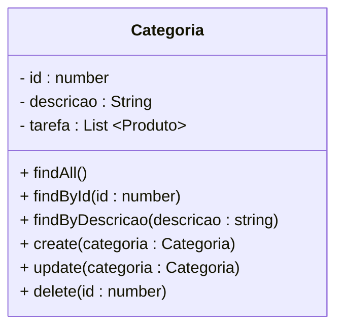

<h1>Projeto 02 - Todo-List - Relacionamento entre Classes - Módulo Categoria - Parte 01</h1>

O que veremos por aqui:

1. Apresentação do Módulo Categoria
2. Criar o Módulo Categoria
3. Criar a Classe Entidade Categoria
4. Criar a Classe Módulo CategoriaModule
5. Registrar a Classe Categoria na Classe CategoriaModule
6. Registrar a Classe Categoria e CategoriaModule na Classe AppModule
7. Criar o Relacionamento entre as Classes Tarefa e Categoria

<h2>1. O Módulo Categoria</h2>

Nesta etapa vamos começar a construir o Módulo Categoria. Veja o Diagrama de Classes abaixo: 



A **Classe Categoria** servirá de modelo para construir a tabela **tb_categorias** (Entidade) dentro do nosso Banco de dados **db_todolist**. Os campos (Atributos) da tabela serão os mesmos que estão definidos no Diagrama de Classes acima. Além de construirmos a Classe Categoria, também faremos o Relacionamento com a Classe Tarefa, construída anteriormente. 

Na próxima etapa vamos construir as Classes **CategoriaService e CategoriaController**, que irá nos auxiliar na interação com o Banco de dados e onde serão implementados os 6 métodos descritos no Diagrama de Classes acima.

Depois de criar a Classe Entidade Categoria, vamos executar o projeto Blog Pessoal. Após a execução veremos que será criado no Banco de dados **db_todolist** a tabela **tb_categorias**. Veja abaixo como ficará a estrutura da nossa tabela através do **Diagrama de Entidade e Relacionamentos (DER)**:

<div align="center"></div>

O Dicionário de dados da nossa tabela tb_categorias será o seguinte:

| Atributo      | Tipo de dado | Descrição           | Chave |
| ------------- | ------------ | ------------------- | ----- |
| **id**        | INT          | Identificador único | PK    |
| **descricao** | VARCHAR(30)  | Categoria da Tarefa |       |

|  | <div align="left"> **ALERTA DE BSM:** *Mantenha a Atenção aos Detalhes ao criar o Módulo Categoria. Todas as Classes construídas no Módulo Tarefa deverão ser construídas no Módulo Categoria com as adaptações pertinentes ao Módulo Categoria.* </div> |
| ------------------------------------------------------------ | ------------------------------------------------------------ |

|  | <div align="left"> **DICA:** *Caso você tenha alguma dúvida sobre como criar o Módulo, executar o projeto, entre outras, consulte a Documentação do Módulo Tarefa.* </div> |
| ------------------------------------------------------------ | ------------------------------------------------------------ |

<br />

<h2>👣 Passo 01 - Criar o Módulo Categoria</h2>

Vamos criar o Módulo Categoria:

1. Na pasta **src**, clique com o botão direito do mouse e clique na opção **New Folder** (Nova Pasta). 

2. O nome da pasta será **categoria**. Após digitar o nome da pasta, pressione a tecla **enter** do seu teclado para concluir. 

<div align="center"></div>

Na sequência, vamos criar a pasta **entities**, dentro do nosso **Módulo Categoria** (pasta categoria):

1. Na pasta **categoria**, clique com o botão direito do mouse e clique na opção **New Folder** (Nova Pasta). 

2. O nome da pasta será **entities**. Após digitar o nome da pasta, pressione a tecla **enter** do seu teclado para concluir. 
2. A estrutura de pasta do Módulo Categoria, ficará igual a imagem abaixo:

<div align="center"></div>

|  | <div align="left"> **ALERTA DE BSM:** *Mantenha a Atenção aos Detalhes ao criar a Classe Entidade. Um erro muito comum é criar a pasta entities fora da pasta do módulo (categoria).* </div> |
| ------------------------------------------------------------ | ------------------------------------------------------------ |

<h2>👣 Passo 02 - Criar a Classe CategoriaModule na pasta Categoria</h2>

Agora vamos criar a Classe **CategoriaModule** que chamaremos de **categoria.module.ts**.

|  | <div align="left"> **ALERTA DE BSM:** *Mantenha a Atenção aos Detalhes ao criar Classe Module. Um erro muito comum é digitar o nome da Classe de forma incorreta. O nome da Classe deve estar dentro dos padrões do Nest para evitar erros na sua aplicação.* </div> |
| ------------------------------------------------------------ | ------------------------------------------------------------ |

1. Clique com o botão direito do mouse sobre a **pasta categoria**, que foi criada dentro da pasta **src** e clique na opção **New File** (Novo Arquivo).

2. O nome do arquivo será **categoria.module.ts**. Após digitar o nome do arquivo, pressione a tecla **enter** do seu teclado para concluir. 

<div align="center"></div>

<h2>👣 Passo 03 - Criar a Classe Entidade Categoria</h2>

Antes de implementarmos o código da Classe **CategoriaModule**, vamos criar a Classe Entidade **Categoria** que chamaremos de **categoria.entity.ts**.

|  | <div align="left"> **ALERTA DE BSM:** *Mantenha a Atenção aos Detalhes ao criar Classe Entity. Um erro muito comum é digitar o nome da Classe de forma incorreta. O nome da Classe deve estar dentro dos padrões do Nest para evitar erros na sua aplicação.* </div> |
| ------------------------------------------------------------ | ------------------------------------------------------------ |

1. Clique com o botão direito do mouse sobre a **pasta entities**, que foi criada dentro da pasta **categoria**, e clique na opção **New File** (Novo Arquivo).

2. O nome do arquivo será **categoria.entity.ts**. Após digitar o nome do arquivo, pressione a tecla **enter** do seu teclado para concluir. 

<div align="center"></div>

Agora vamos criar o código da Classe **Categoria**:

```typescript
import { IsNotEmpty, MaxLength } from "class-validator";
import { Column, Entity, PrimaryGeneratedColumn } from "typeorm";

@Entity({name: "tb_categorias"})
export class Categoria {

    @PrimaryGeneratedColumn()    
    id: number

    @IsNotEmpty()
    @MaxLength(30)
    @Column({length: 30, nullable: false})
    descricao: string

}
```

Veja na tabela abaixo a conversão de **Tipo de dados TypeScript 🡪 MySQL, de acordo com o que foi definido no Diagrama de Classes acima:**

| Atributo      | Tipo de dado TypeScript | Tipo de dado MySQL |
| ------------- | ----------------------- | ------------------ |
| **id**        | number                  | INT                |
| **descricao** | <i>string</i>           | VARCHAR(30)        |

|  | <div align="left">**DICA:** *Para relembrar os tipos de dados do TypeScript, <a href="https://www.typescriptlang.org/docs/handbook/2/everyday-types.html">clique aqui</a> e explore os principais tipos de dados oferecidos pelo TypeScript.* </div> |
| ------------------------------------------------------------ | ------------------------------------------------------------ |

Observe que o código é semelhante ao da Classe Entidade **Tarefa**, do Módulo Tarefa.

<div align="left"> <a href="https://docs.nestjs.com/techniques/database" target="_blank"><b>Documentação: <i>Banco de dados com Nest</i></b></a></div>

<div align="left"> <a href="https://typeorm.io/entities" target="_blank"><b>Documentação: <i>Entidades no TypeORM</i></b></a></div>

<div align="left"> <a href="https://github.com/typestack/class-validator" target="_blank"><b>Documentação: <i>Pacote Validation</i></b></a></div>

<br />

<h2>👣 Passo 04 - Registrar a Classe Categoria na Classe CategoriaModule</h2>

Vamos implementar o código da Classe **CategoriaModule** e registrar a Classe **Categoria**. Veja abaixo a implementação da Classe **CategoriaModule**:

```typescript
import { Module } from "@nestjs/common";
import { TypeOrmModule } from "@nestjs/typeorm";
import { Categoria } from "./entities/categoria.entity";

@Module({
    imports:[TypeOrmModule.forFeature([Categoria])],
    providers:[],
    controllers:[],
    exports:[TypeOrmModule]
})
export class CategoriaModule { }
```

Observe que o código é semelhante ao da Classe Módulo **TarefaModule**, do Módulo Tarefa.

|  | <div align="left"> **ATENÇÃO:** *Se uma Classe for importada com o caminho absoluto (src/entities/categoria.entity.ts), os testes da aplicação com o framework Jest não serão executados. O Jest não reconhece caminho absoluto, apenas caminho relativo (./entities/categoria.entity.ts)* </div> |
| ------------------------------------------------------------ | ------------------------------------------------------------ |

<div align="left"> <a href="https://docs.nestjs.com/modules" target="_blank"><b>Documentação: <i>Módulos no Nest</i></b></a></div>

<br />

<div align="left"> <a href="https://github.com/rafaelq80/backend_todolist_nest/blob/09_Recurso_Categoria_Relacionamento/todolist/src/categoria/categoria.module.ts" target="_blank"><b>Código fonte da Classe CategoriaModule</b></a></div>

<br />

<h2>👣 Passo 05 - Registrar as Classes Categoria e CategoriaModule na Classe AppModule</h2>

Para finalizar, vamos registrar a Classe **Tarefa** no Módulo principal da  aplicação, a Classe **AppModule**. 

1. Abra a Classe **AppModule**, localizada na pasta **src**, conforme indicada na imagem abaixo:

<div align="center"></div>

2. Implemente as alterações, indicadas pelas setas na imagem abaixo:

<div align="left"></div>

Vamos analisar o código:

**Linha 3:** Importamos a Classe **CategoriaModule**, criada anteriormente. Observe que na importação da Classe foi utilizado o caminho relativo (**./categoria/categoria.module.ts**) por questões de boas práticas. 

**Linha 4:** Importamos a Classe **Categoria**, criada anteriormente. Observe que na importação da Classe foi utilizado o caminho relativo (**./categoria/entities/categoria.entity.ts**) por questões de boas práticas. 

**Linha 17:** No array **entities** vamos inserir todas as **Classes Entidades** do módulo. Insira no array a Classe **Categoria**, ao lado da Classe Tarefa, separadas por uma virgula.

|  | <div align="left"> **ATENÇÃO:** *Se uma Classe Entidade não for registrada no Módulo principal da aplicação (AppModule), a tabela associada a Entidade não será criada no Banco de dados.* </div> |
| ------------------------------------------------------------ | ------------------------------------------------------------ |

**Linha 21:** No array **imports** vamos inserir o Módulo **CategoriaModule**.  Insira no array a Classe **CategoriaModule**, abaixo da Classe TarefaModule, separadas por uma virgula.

|  | <div align="left"> **ATENÇÃO:** *Se um Módulo não for registrado no Módulo principal da aplicação (AppModule), não será possível criar um Relacionamento com as Classes Entidades deste Módulo.* </div> |
| ------------------------------------------------------------ | ------------------------------------------------------------ |

<div align="left"> <a href="https://docs.nestjs.com/modules" target="_blank"><b>Documentação: <i>Módulos no Nest</i></b></a></div>

<br />

<div align="left"> <a href="https://github.com/rafaelq80/backend_todolist_nest/blob/09_Recurso_Categoria_Relacionamento/todolist/src/app.module.ts" target="_blank"><b>Código fonte da Classe AppModule</b></a></div>

<br />

<h2>👣 Passo 06 - Executar o projeto</h2>

1. Verifique se você está dentro da pasta do projeto, como mostra a figura abaixo:

<div align="center"></div>

2. Digite o comando ***npm run start:dev***, para compilar e executar o nosso projeto **todolist**. 

```bash
npm run start:dev
```

3. Se tudo deu certo, o resultado será semelhante ao da figura abaixo:

<div align="center"></div>

4.Aparentemente não mudou nada, mas vamos checar o Banco de dados...

<br />

<h2>👣 Passo 07 - Checar o Banco de dados</h2>

1. Abra o **MySQL Workbench** 
1. Verifique se a tabela **tb_categorias** foi criada no Banco de dados **db_todolist**, como mostra a figura abaixo:

<div align="center"></div>

<br />
	
<h2>2. Relacionamento entre Classes</h2>

**Mapeamento Objeto-Relacional (ORM)** é o processo de conversão das Classes em Tabelas (Entidades) no Banco de dados da aplicação e vice-versa. Em outras palavras, isso nos permite interagir com um Banco de dados Relacional sem utilizar código SQL. O **TypeORM** é um framework que define como persistir dados em aplicativos TypeScript. O foco principal do TypeORM é a camada ORM. Para mais detalhes, consulte o cookbook <a href="03.md" target="_blank"><b>Introdução ao TypeORM</b></a>.

O **TypeORM** simplifica o tratamento do modelo de Banco de dados Relacional nos aplicativos Nest quando mapeamos cada Tabela para uma única Classe Entidade (Model). Assim como no MySQL, precisamos criar o Relacionamento entre duas tabelas, no TypeORM também precisamos criar o **Relacionamento entre as Classes** e desta forma ele construirá os Relacionamento entre as duas Tabelas no Banco de dados assim como fizemos no MySQL. 

Nesta etapa vamos construir o Relacionamento do Módulo Categoria com o Módulo Tarefa, a partir das Classes Entidade Categoria e Tarefa. Veja o Diagrama de Classes abaixo: 

<div align="center"></div>

Para construirmos o Relacionamento entre Classes, assim como no SQL, precisamos definir a cardinalidade do Relacionamento. Para definir a Cardinalidade, o TypeORM utiliza os decorators abaixo:

| Cardinalidade | Decorator   | Descrição                                                    |
| ------------- | ----------- | ------------------------------------------------------------ |
| **1:1**       | @OneToOne   | No relacionamento OneToOne, um Objeto pode pertencer a apenas um outro Objeto, ou seja, é uma ligação um para um. <br />No Banco de dados significa que cada linha de uma Entidade se refere a **<u>apenas</u>** uma linha de outra Entidade. |
| **1:N**       | @OneToMany  | No relacionamento OneToMany,  um Objeto é referenciado com muitos Objetos.<br/>Em Bancos de dados relacionais, cada linha de uma entidade é referenciada a muitos registros filhos em outra entidade.<br/>O importante é que os registros filhos não podem ter várias mães. Em  uma relação OneToMany entre a Tabela A e a Tabela B, cada linha da Tabela A está ligada a 0, 1 ou muitas linhas da Tabela B.<br/>Numa Relação Unidirecional, a relação será uma relação OneToMany porquê o lado Um da relação manda no Relacionamento. |
| **N:1**       | @ManyToOne  | No relacionamento  ManyToOne,  um Objeto é referenciado com outro Objeto que contém valores únicos.<br/>Em Bancos de dados Relacionais, esses relacionamentos são aplicáveis usando o par Chave Estrangeira (Lado N da Relação) e a  Chave Primária (Lado 1 da Relação), entre as tabelas. O Lado N também deve ter uma Chave Primária.<br />Numa Relação Bidirecional, essa anotação será utilizada para referenciar o Lado Um da Relação, através de um Objeto, que funcionará como a Chave Estrangeira. |
| **N:M**       | @ManyToMany | No relacionamento ManyToMany,  muitos Objetos são referenciados com muitos outros Objetos.<br/>Em Bancos de dados Relacionais, o relacionamento Muitos para Muitos uma ou mais linhas de uma Entidade são associadas a mais de uma linha em outra Entidade.<br />Os relacionamentos ManyToMany exigem um pouco mais de trabalho do que os outros relacionamentos.<br />Em um Banco de dados, um Relacionamento ManyToMany envolve uma terceira Tabela intermediária, que faz referência a ambas as outras tabelas armazenando as 2 Chaves estrangeiras. |

No modelo Relacional, 1:N e N:1 são a mesma coisa, entretanto no Relacionamento de Classes, além da Cardinalidade é necessário definir a Direção do Relacionamento, ou seja, Se apenas a Classe Mãe exibe a Classe Filha (Unidirecional) ou se Classe Filha também Exibirá a Classe Mãe (Bidirecional), ao listar os dados em uma consulta.

No Modelo Relacional todo Relacionamento é **Unidirecional**, ou seja, **apenas a Tabela que possui a Chave Estrangeira acessa a outra Tabela**. No Relacionamento de Classes, existe a possibilidade do Relacionamento ser **Bidirecional**, ou seja, uma **Classe acessa a outra e vice-versa, independente de possuir ou não a Chave Estrangeira**.

Depois de criar o Relacionamento entre as Classes e executar o projeto Blog Pessoal no STS, veremos que será criado no MySQL a Relação entre as tabelas **tb_tarefas** e **tb_categorias** Unidirecional. Veja abaixo como ficará a estrutura da nossa tabela através do **Diagrama de Entidade e Relacionamentos (DER)**:

<div align="center"></div>

Como o TypeORM faz o mapeamento das Tabelas em Objetos, caso o Relacionamento Bidirecional esteja habilitado, a Relação funcionará independente do Banco de Dados ser Unidirecional.

Vamos construir o Relacionamento Bidirecional (1:N) entre as nossas Classes Categoria e Tarefa como veremos a seguir. 

<br />

<h2>👣 Passo 01 - Criar a Relação ManytoOne na Classe Tarefa</h2>

A Classe Tarefa será o lado N:1, ou seja, **Muitas Tarefas podem ter apenas Uma Categoria**. Para criar a Relação vamos inserir depois do último atributo da Classe Tarefa (status), as linhas destacadas em amarelo na figura abaixo:

<div align="left"></div>

**Linha 30:** O decorator **@ManyToOne** indica que a Classe Tarefa será o lado N:1 da relação e terá um **Objeto da Classe Categoria**, chamado **categoria**, que no modelo Relacional será a **Chave Estrangeira na Tabela tb_tarefas (categoriaId)**.

**Linha 31:** Os relacionamentos entre entidades geralmente dependem da existência de outra entidade, por exemplo, o relacionamento **Categoria 🡪 Tarefa**. Sem o Categoria, a entidade Tarefa não tem nenhum significado próprio. Quando excluímos a entidade Categoria, as entidades Tarefa associadas também devem ser excluídas. **"Cascatear" (cascade)**, é a maneira de conseguir isso. Quando executamos alguma ação na entidade de destino (Categoria), a mesma ação será aplicada à entidade associada (Tarefa). 

- **onDelete:** O "cascateamento" foi habilitado apenas na operação Delete, ou seja, apenas quando um Objeto da Classe Categoria for apagado, todos os Objetos da Classe Tarefa associados ao Categoria apagado, também serão apagados. O Inverso não é verdadeiro. As demais operações do CRUD não serão cascateadas.

Além de habilitar no delete, é possível habilitar o cascade na atualização de dados, através da opção **OnUpdate**. No projeto Blog Pessoal, não é necessário habilitar esta opção.

**Linha 33:** Será criado um Objeto da Classe Categoria, que receberá os dados do Categoria associado ao Objeto da Classe Tarefa. Este Objeto representa a Chave Estrangeira da Tabela **tb_tarefas (categoriaid)**.

Veja abaixo o código completo da **Classe Entidade Tarefa**:

```typescript
import { IsNotEmpty, MaxLength } from "class-validator"
import { Column, Entity, ManyToOne, PrimaryGeneratedColumn } from "typeorm"
import { Categoria } from "../../categoria/entities/categoria.entity"

@Entity({name: "tb_tarefas"})
export class Tarefa {

    @PrimaryGeneratedColumn()    
    id: number

    @IsNotEmpty()
    @MaxLength(30)
    @Column({length: 30, nullable: false})
    nome: string

    @IsNotEmpty()
    @Column({length: 5000, nullable: false})
    descricao: string

    @IsNotEmpty()
    @Column({length: 5000, nullable: false})
    responsavel: string
    
    @Column()
    data: Date

    @Column()
    status: boolean

    @ManyToOne(() => Categoria, (categoria) => categoria.tarefas, {
        onDelete: "CASCADE"
    })
    categoria: Categoria

}
```

|  | <div align="left"> **ALERTA DE BSM:** *Mantenha a Atenção aos Detalhes ao criar o Relacionamento entre as Classes. Observe que após habilitar o Relacionamento entre Classes, novas importações de Classes serão necessárias nas primeiras linhas da Classe Tarefa.* </div> |
| ------------------------------------------------------------ | ------------------------------------------------------------ |

<div align="left"> <a href="https://docs.nestjs.com/techniques/database#relations" target="_blank"><b>Documentação: <i>Relacionamento entre Classes</i></b></a></div>

<div align="left"> <a href="https://typeorm.io/relations" target="_blank"><b>Documentação: <i>TypeORM - Relacionamentos</i></b></a></div>

<div align="left"> <a href="https://typeorm.io/many-to-one-one-to-many-relations" target="_blank"><b>Documentação: <i>TypeORM - Relacionamentos One to Many e Many to One</i></b></a></div>

<br />

<div align="left"> <a href="https://github.com/rafaelq80/backend_todolist_nest/blob/09_Recurso_Categoria_Relacionamento/todolist/src/tarefa/entities/tarefa.entity.ts" target="_blank"><b>Código fonte da Classe Tarefa</b></a>
<br /></div>


<br />

<h2>👣 Passo 02 - Criar a Relação OneToMany na Classe Categoria</h2>

A Classe Categoria será o lado 1:N, ou seja, **Uma Categoria pode ter Muitas Tarefas**. Para criar a Relação vamos inserir depois do último atributo da Classe Categoria (descricao), o trecho de código destacado em amarelo na figura abaixo:

<div align="left"></div>

**Linha 16:** O decorator **@OneToMany** indica que a Classe Categoria será o lado 1:N da relação e terá um **array de Objetos da Classe Tarefa**, chamado **tarefa**, para listar todas as tarefas associadas a cada categoria.

**Linha 17:** Será criado um array de Objetos da Classe Tarefa, que receberá os dados das tarefas associadas a cada Objeto da Classe Categoria.

Veja abaixo o código completo da **Classe Entidade Tarefa**:

```typescript
import { IsNotEmpty, MaxLength } from "class-validator";
import { Column, Entity, OneToMany, PrimaryGeneratedColumn } from "typeorm";
import { Tarefa } from "../../tarefa/entities/tarefa.entity";

@Entity({name: "tb_categorias"})
export class Categoria {

    @PrimaryGeneratedColumn()    
    id: number

    @IsNotEmpty()
    @MaxLength(30)
    @Column({length: 30, nullable: false})
    descricao: string

    @OneToMany(() => Tarefa, (tarefa) => tarefa.categoria)
    tarefas: Tarefa[] 
    
}
```

|  | <div align="left"> **ALERTA DE BSM:** *Mantenha a Atenção aos Detalhes ao criar o Relacionamento entre as Classes. Observe que após habilitar o Relacionamento entre Classes, novas importações de Classes serão necessárias nas primeiras linhas da Classe Categoria.* </div> |
| ------------------------------------------------------------ | ------------------------------------------------------------ |

<div align="left"> <a href="https://docs.nestjs.com/techniques/database#relations" target="_blank"><b>Documentação: <i>Relacionamento entre Classes</i></b></a></div>

<div align="left"> <a href="https://typeorm.io/relations" target="_blank"><b>Documentação: <i>TypeORM - Relacionamentos</i></b></a></div>

<div align="left"> <a href="https://typeorm.io/many-to-one-one-to-many-relations" target="_blank"><b>Documentação: <i>TypeORM - Relacionamentos One to Many e Many to One</i></b></a></div>

<br />

<div align="left"> <a href="https://github.com/rafaelq80/backend_todolist_nest/blob/09_Recurso_Categoria_Relacionamento/todolist/src/categoria/entities/categoria.entity.ts" target="_blank"><b>Código fonte da Classe Categoria</b></a></div>

<br />

<h2>👣 Passo 03 - Executar o projeto</h2>

1. Verifique se você está dentro da pasta do projeto, como mostra a figura abaixo:

<div align="center"></div>

2. Digite o comando ***npm run start:dev***, para compilar e executar o nosso projeto **todolist**, caso não esteja em execução. 

```bash
npm run start:dev
```

3. Se tudo deu certo, o resultado será semelhante ao da figura abaixo:

<div align="center"></div>

4.Aparentemente não mudou nada, mas vamos checar o Banco de dados...

<br />

<h2>👣 Passo 04 - Checar o Banco de dados</h2>

1. Abra o **MySQL Workbench** 
1. Verifique se a **Chave Estrangeira (categoriaId)** foi criada na Tabela **tb_tarefas**, no Banco de dados **db_todolist**, como mostra a figura abaixo:

<div align="center"></div>

<br />

<div align="left"> <a href="https://github.com/rafaelq80/backend_todolist_nest/tree/09_Recurso_Categoria_Relacionamento" target="_blank"><b>Código fonte do Projeto</b></a></div>

<br /><br />

<div align="left"><a href="README.md">Voltar</a></div>